#+TITLE: Dosieres PDF de Ciudad Santo Domingo
#+LANGUAGE: es
#+STARTUP: overview
#+MACRO: tarjeta @@latex:\csdtarjeta{$1}{$2}{$3}@@
#+MACRO: web [[https://ciudadsantodomingo.org/$1][$2]]

# Fuente única de los dosieres PDF que se descargan desde la web.
#
# Cada subárbol de primer nivel con :EXPORT_FILE_NAME: produce un PDF:
#   make pdf                        -> pdf/build/*.pdf   (para revisar)
#   make pdf DOC=gestion-del-agua   -> solo ese documento
#   make pdf-docs                   -> además los copia a docs/ (los que enlaza la web)
#
# Propiedades de cada documento:
#   EXPORT_FILE_NAME  nombre del PDF, sin extensión (el mismo que en docs/)
#   EXPORT_TITLE      título de portada (si falta, se usa el del encabezado)
#   EXPORT_DATE       fecha que aparece en portada y al final
#   ETIQUETA          texto de la cabecera de las páginas: | GESTIÓN DEL AGUA |
#
# Dentro de cada documento, los encabezados ** son secciones, *** subsecciones
# y **** apartados (subrayados). Bloques especiales disponibles:
#   #+begin_recuadro ... #+end_recuadro     recuadro verde claro
#   #+begin_destacado ... #+end_destacado   recuadro verde, texto blanco
#   #+begin_aviso ... #+end_aviso           recuadro verde con borde rojo discontinuo
#   #+begin_quote ... #+end_quote           cita en verde y cursiva
#   #+begin_fotos ... #+end_fotos           imágenes en fila con pie de foto
#   #+begin_panel ... #+end_panel           panel con degradado verde, en negrita
#   #+begin_center / #+begin_flushright     texto centrado / alineado a la derecha
# A los recuadros se les puede cambiar el color:
#   #+attr_latex: :options [title={Datos de contacto},colback=csdcoral]
# Tarjeta de teléfono destacada:
#   {{{tarjeta(Título,Teléfonos,Lema)}}}
# Iconos (Font Awesome 5) en diagramas y textos: @@latex:\faPhone@@
# Para darles título:  #+attr_latex: :options [title={Mi título}]
#
# Las imágenes propias de los PDF van en pdf/img/ y se enlazan como
# [[file:pdf/img/nombre.jpg]] (así también se ven desde Emacs).
# Para enmarcar una imagen (p. ej. un documento escaneado):
#   #+attr_latex: :width .8\linewidth :options frame
# Para un salto de página:  #+latex: \newpage

* Gestión del agua
:PROPERTIES:
:EXPORT_FILE_NAME: gestion-del-agua
:EXPORT_DATE: Septiembre 2026
:ETIQUETA: gestión del agua
:END:

** Descripción de la red de agua y saneamiento de Ciudad Santo Domingo

Ciudad Santo Domingo es un núcleo de población exclusivamente residencial,
formado por alrededor de 1.000 parcelas unifamiliares, 8 subcomunidades de
pisos, un colegio público (CEIP) con capacidad para 350 alumnos, una
residencia con capacidad para 300 personas mayores asistidas y 124
apartamentos para no asistidos, 2 centros comerciales y la parroquia. En
total, unos 5.000 residentes permanentes.

La urbanización dispone de una red propia de abastecimiento de agua y de su
correspondiente red de evacuación y depuración de aguas residuales. Desde su
constitución en 1966, la Comunidad de Propietarios realiza el tratamiento
integral de sus aguas.

- Para alimentar la red de abastecimiento se perforaron 11 pozos de captación, de entre 250 y 350 metros de profundidad, de los que 8 están plenamente operativos.
- Ciudad Santo Domingo es titular de una concesión de la Confederación Hidrográfica del Tajo para la captación y aprovechamiento de aguas privativas de 2.084.228 m³ anuales, vigente hasta octubre de 2038.
- Seis pozos vierten en un depósito colector situado en la cota 613, desde donde el agua se eleva al depósito regulador mediante cuatro grupos de electrobombas sumergidas con una potencia total de 180 CV.
- El depósito regulador tiene una capacidad de 6.000 m³ y está situado en la cota 670,5. Otros dos pozos vierten directamente en él. Existe además un segundo depósito colector de 2.500 m³.
- La red de distribución tiene 36,5 km de longitud, con diámetros entre 100 y 500 mm, una presión de 10 a 15 atmósferas y juntas de unión Gibault.
- Está dividida en tres sectores. El principal, que alimenta la mayor parte de las parcelas, recibe el agua por gravedad. Los otros dos se alimentan mediante grupos de presión, uno en el propio depósito regulador y otro en el depósito de la Avenida del Monte.
- El grupo de presión del depósito regulador abastece a 315 parcelas situadas entre las cotas 630 y 670,5. El del depósito de la Avenida del Monte da servicio a 82 parcelas situadas entre las cotas 642,5 y 658.
- Las aguas residuales se evacúan por una red de saneamiento, también propia, de 30 km de longitud, con tubería de hormigón de 30 cm de diámetro, que vierte a través de un colector emisario de 600 mm.
- Existe una red separativa de pluviales, mantenida igualmente por la Comunidad de Propietarios, que vierte directamente al río Guadalix.
- La estación depuradora (EDAR), propia, es de oxidación-reducción, con un tanque reactor único y un aireador que combina agitación y aireación, con una potencia nominal de 37 kW. Cuenta con concesión de la Confederación Hidrográfica del Tajo para el tratamiento de aguas residuales domésticas, con un canon de vertido de 860.000 m³ anuales.
- Ciudad Santo Domingo cuenta además con una segunda red separativa de agua, suministrada por el Canal de Isabel II.

En 2008 se implantaron nuevas tarifas del agua que incentivan el ahorro. Desde
entonces, los volúmenes extraídos y consumidos se han reducido, en valores
consolidados, en torno a un 20 %.

En 2017 se automatizaron y monitorizaron todos los medios de producción
(pozos, sondas, grupos de presión y depósitos), conectados a un ordenador
central y gobernados por un programa de tipo /scada/. Con ello se optimizaron
producciones y rendimientos y se redujo de forma notable el consumo de
energía: la instalación opera solo en horas de consumo /valle/ y, a lo sumo,
/llanas/.

En 2018 se completó la EDAR con un deshidratador de fangos y un sistema de
dosificación de cloruro férrico para la eliminación de fósforo, contratado a
SUEZ.

En 2020 se contrataron tres parques solares para alimentar con energía
fotovoltaica, respectivamente, el pozo del depósito, el grupo de presión del
depósito y la EDAR, con potencias de funcionamiento de 65 kW, 22 kW y 30 kW.
Las instalaciones constan de:

- Pozo Depósito :: campo fotovoltaico de 324 módulos de 380 Wp, 123 kWp en total, con 3 inversores y una generación anual de 211.000 kWh.
- Grupo de Presión :: campo fotovoltaico de 108 módulos de 380 Wp, 41 kWp en total, con 1 inversor y una generación anual de 70.340 kWh.
- EDAR :: campo fotovoltaico de 216 módulos de 380 Wp, 82 kWp en total, con 2 inversores y una generación anual de 141.700 kWh.

Los parques están plenamente operativos.

#+latex: \newpage
** Concesión de las aguas

#+attr_latex: :width .82\linewidth :options frame
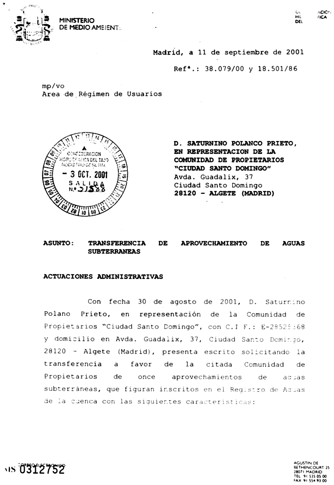

Con fecha 11 de septiembre de 2001 se obtuvo la transferencia protocolizada
del aprovechamiento de aguas subterráneas a través de 11 pozos, por un total
aproximado de 2.071.661 m³. La concesión caduca el 24 de octubre de 2038,
fecha en la que se procederá a su renovación.

** Canal de Isabel II

En 2002 la Comunidad decidió acometer una segunda red de suministro de agua.
Se constituyó una cooperativa que sufragó las obras: aducción, depósito
regulador y red de distribución. Una vez concluidas, la red se entregó al
Canal de Isabel II para su explotación y mantenimiento, con el compromiso
contractual de que el Canal aplicaría bonificaciones sobre el consumo hasta
amortizar la inversión.

Concluida esa fase, en febrero de 2012 se firmó un nuevo convenio entre el
Ayuntamiento, el Canal de Isabel II y la Comunidad de Propietarios que fija
las condiciones de suministro. Su estipulación segunda («Cantidad a abonar»)
establece:

#+begin_quote
«Los contratantes de nuevos suministros de agua de consumo humano deberán
abonar a la URBANIZACIÓN la cantidad de 2.800 €, que supone el importe
estimado que habrán abonado el resto de vecinos de la Urbanización “Ciudad
Santo Domingo” para la ejecución de las obras de renovación de la red interior
de agua de consumo humano de dicho ámbito, en concepto de cuota fija.»
#+end_quote

Así pues, en Ciudad Santo Domingo existen dos redes de agua separadas: la de
los pozos de la urbanización y la del Canal de Isabel II, destinada al consumo
humano.

La red de saneamiento es única para ambas: la Comunidad mantiene la red y
depura el agua residual de las dos.

** Plan de modernización del sistema de pozos: monitorización y parques solares

La red de agua es uno de los mayores activos de Ciudad Santo Domingo. Permite
a la Comunidad aplicar unas cuotas por el suministro de agua muy inferiores a
las de otras urbanizaciones de la zona y, sobre todo, disponer de recursos
suficientes para abastecer a los vecinos incluso en los días más secos del
año.

Se trata, sin embargo, de una instalación con más de 45 años de antigüedad que
requería una puesta al día con un triple objetivo: *(1) garantizar la
continuidad* de la red y del sistema, renovando los tramos próximos a la
obsolescencia o con fallos recurrentes; *(2) garantizar la independencia* y la
capacidad de reacción operativa mediante la automatización y la monitorización
permanente del sistema; y *(3) reducir los costes de operación* aplicando
nuevas tecnologías y ajustando la estrategia operativa, para mejorar la
eficiencia energética y reducir de forma significativa el gasto anual del
servicio.

Con ese fin, en 2016 se propuso a la Asamblea un *programa de modernización y
monitorización de la red de pozos* en dos fases, que se aprobó por unanimidad.
Hoy está plenamente operativo y proporciona ahorros importantes.

La *primera fase* fue la implantación de un sistema de automatización y
monitorización (SAM) de pozos, depósitos y grupos de presión, terminada en
2017. El SAM permite conocer en tiempo real, incluso desde el móvil, el caudal
que bombea cada pozo, el nivel de los depósitos, el rendimiento de los grupos
de presión y las posibles anomalías, y actuar sobre el sistema en remoto las
24 horas del día: arrancar o parar los pozos según una programación o de forma
reactiva ante alarmas o situaciones no deseadas. Gracias al SAM se conoce
mucho mejor el perfil de la demanda de agua de la Comunidad y se ajusta a él
la producción de los pozos para lograr la máxima eficiencia.

El resultado de esta primera fase fue muy positivo, y en 2019 se propuso
abordar la segunda:

#+attr_latex: :options [title={Actuaciones propuestas en 2019}]
#+begin_recuadro
1. *Renovación de los cuadros eléctricos* de varios pozos, obsoletos en su
   mayor parte (cuadro Colector, pozo Viaducto, pozo Monte, pozo Barranca,
   grupo de presión Monte, etc.).
2. *Inversión en tres parques solares:*

   | a) Pozo Depósito     | para una potencia de | 123 kWp |
   | b) Grupo de Presión  | para una potencia de |  41 kWp |
   | c) EDAR (depuradora) | para una potencia de |  82 kWp |
   |----------------------+----------------------+---------|
   |                      | *TOTAL*              | *246 kWp* |
#+end_recuadro

Para contratar los parques solares se convocó un concurso restringido al que
se invitó a seis de las empresas más representativas del sector, incluido el
proveedor eléctrico de la Comunidad, Iberdrola. La inversión se planteó
financiarla con un préstamo bancario amortizable con los ahorros generados. La
oferta más ventajosa fue la de la empresa ERCAM, S.A.

La instalación sufrió retrasos importantes porque las placas, los inversores y
el resto de los componentes proceden de China, y la pandemia declarada a
principios de 2020 afectó tanto a la fabricación como al transporte. Los
parques están terminados y plenamente operativos.

#+attr_latex: :options [Parque solar Depósito]
#+begin_fotos
#+attr_latex: :width .48\linewidth :center nil
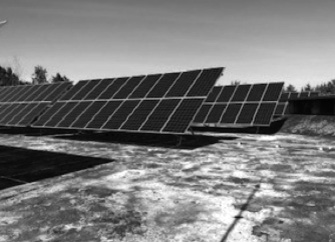 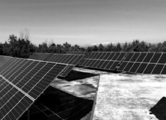
#+end_fotos

#+attr_latex: :options [Parque solar de Las Balsas]
#+begin_fotos
#+attr_latex: :width .48\linewidth :center nil
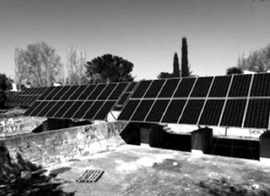 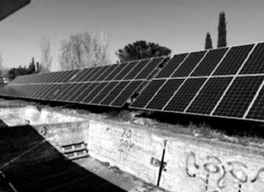
#+end_fotos

* Seguridad
:PROPERTIES:
:EXPORT_FILE_NAME: seguridad
:EXPORT_DATE: Septiembre 2026
:ETIQUETA: seguridad Ciudad Santo Domingo
:END:

{{{tarjeta(Control de seguridad Santo Domingo,916 221 507 / 646 112 097,estamos para ayudarle)}}}

El Servicio de Seguridad de Ciudad Santo Domingo tiene como fin ayudar y
proteger al conjunto de los vecinos de la urbanización y sus bienes. Es uno de
los servicios que presta la Comunidad para mejorar la calidad de vida de
todos. Con ese mismo objetivo, le ofrecemos a continuación algunas
recomendaciones en materia de seguridad.

#+begin_quote
«Nuestra seguridad se apoya en los vigilantes y en las alarmas de las
viviendas. El vigilante acude ante una sospecha o cuando se activa una
alarma; de ahí la importancia de que cada vivienda disponga de la suya. Si
no tiene sistema de alarma, contrátelo: apenas representa el 0,05 % del
valor de su vivienda. Cuantas más viviendas tengan su alarma conectada a la
central, más segura será la urbanización.»
#+end_quote

** Consejos de seguridad en la vivienda

**** Cuando esté en casa

- Haga evidente su presencia en el domicilio.
- Deje el menor número posible de puertas y ventanas sin asegurar y, si es posible, _active la alarma_ de las zonas que no vaya a utilizar.
- _*No abra la puerta de su casa a desconocidos*_, pero sí conteste al interfono y observe. Si quien llama es personal de una empresa de servicios (teléfono, electricidad, gas, agua, etc.), pídale que se identifique. Si quiere confirmar la identidad del visitante, no llame al número de la tarjeta que le muestre, ya que podría ser el de un cómplice. Ante cualquier duda, llame al Control de Seguridad (916 221 507) y una de nuestras patrullas identificará y confirmará la identidad del visitante.
- Ante la presencia de _*personas extrañas*_ en los alrededores, avise al Control de Seguridad y tome nota de la matrícula de cualquier vehículo que le parezca sospechoso.
- _*«Botón del pánico»*_. Las alarmas de los vecinos se están unificando en un solo operador que retransmite de inmediato los avisos a nuestro Control de Seguridad. Los nuevos equipos disponen de un «botón del pánico» que hace que nuestras patrullas se personen en el lugar de la alarma de inmediato.

**** Cuando esté ausente

- Cierre con llave todas las puertas y cierre las ventanas, especialmente las que den a zonas poco visibles desde el exterior.
- No deje juegos de llaves en escondites.
- El Control de Seguridad ofrece un _«servicio de custodia de llaves»_, gratuito y con todas las garantías legales. Si su ausencia va a ser más larga de lo habitual:
  - comuníquelo al Control de Seguridad;
  - facilite sus datos de contacto, o actualícelos;
  - deposite un juego de llaves en custodia (la mayoría de los residentes ya lo hace).
- Informe al Control de Seguridad de las personas que tengan que acceder a su domicilio o parcela durante su ausencia, y acredítelas.

**** Consejos generales

- Si no lo ha hecho, guarde ahora mismo los teléfonos de seguridad en su móvil y en el de los suyos: *916 221 507* y *646 112 097*.
- La Comunidad cuenta en plantilla con un Director de Seguridad. Consúltele todas sus dudas: podrá asesorarle y le prestará el apoyo que necesite.
- Cuando vuelva a su domicilio, observe si hay personas en los alrededores o en los vehículos próximos a su casa. En caso afirmativo, pase de largo y avise al Control de Seguridad, aunque sea una hora intempestiva o pueda tratarse de una falsa alarma.
- Si al llegar a su casa nota algo anormal, no entre: comuníquelo al Control de Seguridad y le prestarán ayuda de inmediato.
- En caso de robo consumado, evite alterar el escenario para facilitar la labor de la policía científica.
- Si detecta marcas o adhesivos desconocidos en sus puertas, accesos o buzones, infórmenos: lo pondremos en conocimiento de las autoridades.
- Al contratar servicio doméstico, pida referencias y observe su comportamiento durante los primeros días. Evite que el personal ajeno conozca los cuartos de seguridad o la ubicación de las cajas fuertes.
- No ponga ningún dato en sus llaves y preste atención cuando haga duplicados.
- Cambie la cerradura al instalarse en una vivienda nueva o habitada anteriormente, si ha reformado su casa y algún trabajador ha tenido acceso a las llaves, siempre que pierda las llaves y si la cerradura es antigua.
- Instale un sistema que le permita ver a la persona que llama a su puerta.
- Fotografíe o anote la marca, el modelo y el número de serie de sus objetos de valor, para poder reconocerlos si los roban.
- Asegúrese de que la puerta del garaje quede cerrada, tanto al salir como al entrar.
- Instale un sistema de alarma antiintrusión: en instantes, el Control de Seguridad enviará las patrullas a su domicilio.

**** Si sorprende o le sorprenden intrusos en su casa

- Si su sistema de alarma dispone de *«botón del pánico»*, utilícelo. Acudiremos de inmediato.
- Gritar y pedir socorro puede intimidar al intruso. Si no es así, mantenga la calma, acceda a sus peticiones y no se ponga en riesgo.
- Observe las características esenciales del intruso (edad, estatura, color de pelo, rasgos del rostro, acento, vestimenta, dirección de la huida, vehículo utilizado, etc.). Cuanto más precisa sea su información, mayores serán las posibilidades de localizar al delincuente y recuperar los objetos sustraídos.
- Si son varios los agresores, procure centrarse en uno de ellos, el más próximo o el que más destaque.
- Una vez cometido el delito, avise cuanto antes al Control de Seguridad: seremos los primeros en intervenir y, a la vez, llamaremos a la Policía o a la Guardia Civil.
- Mientras llegan, anote sus observaciones. No comente el suceso con otras personas, para no mezclar sus impresiones con las de ellas, y no toque ni coloque nada hasta que llegue la Policía o la Guardia Civil: podría destruir pruebas sin querer.

**** Protección de los niños

- Enseñe a los niños su nombre, apellidos, domicilio y teléfono.
- Deben saber que, si se pierden, lo mejor es quedarse parados: sus familiares o el servicio de seguridad, al notar su ausencia, volverán sobre sus pasos.
- No les asuste con que «viene la policía». Al contrario: inculque a sus hijos que, en caso de necesidad, recurran preferiblemente a personas uniformadas.
- Explíqueles a quién dirigirse en caso de peligro, tanto en la calle como en casa.
- Procure conocer a las amistades y compañías de sus hijos.
- Explíqueles las ventajas de volver a casa en grupo. Si tienen que hacerlo solos, pueden pedir en el Control de Seguridad que les acompañe un vigilante.
- Que no abran la puerta de casa cuando estén solos.
- Que rechacen siempre la invitación de un desconocido a subir a un coche o a acompañarle con cualquier pretexto.
- Que no acepten golosinas, caramelos, tabaco, etc. de personas que no conozcan.
- Preste atención a cualquier relato de su hijo sobre una persona que haya intentado acariciarle, regalarle algo, etc. Dígale que nunca debe guardar en secreto esas situaciones, aunque se lo pidan.

#+begin_panel
Lo ideal es que las señales de su central de alarma se reciban
_directamente_ en nuestro Control de Seguridad, por vía _«dual» (teléfono y
radio)_ y de forma _telemática e instantánea_.

La Comunidad ha invertido de forma importante en sistemas y comunicaciones
de seguridad. Utilice los medios que pone a su disposición.

#+latex: \input{pdf/fig/seguridad-comunicaciones}

Compruebe periódicamente que sus datos están actualizados: personas,
teléfonos de contacto, correo electrónico, matrículas de los vehículos,
personas a su servicio autorizadas, etc.

Para cualquier cuestión sobre su seguridad, consúltenos.
#+end_panel

* Procedimiento de recogida de podas
:PROPERTIES:
:EXPORT_FILE_NAME: recogida-podas
:PORTADILLA: no
:EXPORT_TITLE: Recogida de podas
:EXPORT_DATE: Septiembre 2026
:ETIQUETA: asuntos municipales
:END:

# La carta de presentación de la concejala de Medio Ambiente (octubre de
# 2021), que abría la versión anterior, se ha retirado en la revisión de
# estilo de septiembre de 2026 por estar ligada a la temporada 21/22. Se
# conserva aquí, comentada, por si la Junta decide recuperarla.
#
# Estimado vecino/a:
#
# La recogida de poda privada por un ayuntamiento es un servicio atípico. No
# obstante, iniciado hace ya muchos años en la Urbanización Santo Domingo, este
# «servicio» se ha consolidado como parte de las actuaciones del municipio en la
# urbanización.
#
# Sin embargo, hasta la fecha, no se ha resuelto satisfactoriamente, ni para
# los vecinos/as, ni para la Comunidad de Propietarios ni para el propio
# Ayuntamiento. Al no existir una regulación suficientemente clara y práctica,
# se ha interpretado frecuentemente por muchos vecinos/as como una actividad
# arbitraria sin límites, ni de volumen, ni de tipo de residuos, ni de fechas;
# provocando incluso conflictos entre los propios vecinos/as además de una
# situación insostenible en las calles de la urbanización.
#
# La pasada temporada se realizó un primer intento de racionalización, que
# empezó con buenos resultados pero que, desgraciadamente, colapsó con la
# borrasca Filomena, registrándose un incremento superior en cinco veces a la
# carga vegetal normal.
#
# Esta nueva temporada 21/22 se ha optado, mediante un nuevo concurso público,
# por implementar un sistema que ha probado su eficacia en otros municipios. El
# nuevo sistema, basado en sacas de 1 m³, racionaliza el servicio y, sobre todo,
# evita los indeseados montones de poda por todas las calles.
#
# Se ha calculado que una poda estandarizada genera un volumen de 5 m³ por
# parcela. Este volumen es recogido por el Ayuntamiento sin ningún coste para
# el vecino, y el propietario de cada parcela debe colaborar siguiendo un
# protocolo de fechas.
#
# Todos los residuos vegetales que excedan este volumen, o que procedan de
# talas y no de podas (confusión frecuente), deben ser gestionados y retirados
# de manera privada, bien por el propietario o bien por su empresa de
# jardinería. Es relevante señalar que las empresas de jardinería tienen
# obligación de retirar los residuos, cosa que en el pasado trataban de evitar,
# saturando la capacidad pública de recogida.
#
# En las siguientes páginas se explica el nuevo sistema. No obstante, puede
# usted consultar sus dudas en la Tenencia de Alcaldía de Santo Domingo o en
# los servicios de Medio Ambiente del Ayuntamiento.
#
# Reciba mis más cordiales saludos.
#
# Estrella Pereda, Concejal de Medio Ambiente, Ayuntamiento de Algete

El Ayuntamiento de Algete recoge cada temporada, sin coste para el vecino, los
restos de poda de las parcelas de Ciudad Santo Domingo. Es un servicio poco
habitual en un municipio, que se presta en la urbanización desde hace muchos
años. Desde la temporada 2021-2022 se organiza mediante sacas normalizadas de
1 m³, un sistema que ya había demostrado su eficacia en otros municipios y que
evita los montones de poda en las calles.

Se calcula que una poda normal genera unos 5 m³ por parcela. Ese volumen lo
recoge el Ayuntamiento; el propietario colabora siguiendo el calendario que se
explica a continuación. Los restos vegetales que excedan ese volumen, o que
procedan de talas y no de podas (una confusión frecuente), debe gestionarlos y
retirarlos el propietario o su empresa de jardinería, que tiene la obligación
de hacerlo.

Cualquier duda puede consultarla en la Tenencia de Alcaldía de Santo Domingo o
en los servicios de Medio Ambiente del Ayuntamiento.

** Protocolo de recogida de poda en Ciudad Santo Domingo

1. El Ayuntamiento presta el servicio gratuito de recogida de poda a todas las parcelas de la urbanización durante la temporada de poda, que fija cada año. Con carácter general, la Ordenanza de Residuos la sitúa entre el *1 de noviembre y el 30 de abril*.
2. La recogida se hace mediante *sacas homologadas*.
3. Se entregan *5 sacas de 1 m³ aproximadamente por parcela*, en dos entregas:
   - _primera entrega (diciembre, enero y febrero)_: 2 sacas por parcela;
   - _segunda entrega (febrero, marzo y abril)_: 3 sacas adicionales por parcela;
   - quien lo prefiera *puede retirar las 5 sacas de una sola vez en el segundo periodo (febrero a abril)*.
4. *Si genera _más de 5 sacas_ de restos de poda, deberá contratar un contenedor y gestionarlos por sus propios medios.* El Punto Limpio de la calle Vivero solo admite restos de poda hasta 3 bolsas de 240 litros por persona.
5. *Para obtener las sacas:*
   - se solicitan en la *Tenencia de Alcaldía*, _presencialmente, por teléfono o por correo electrónico_;
   - _*se recogen en el Punto Limpio de la calle Vivero*_, en su horario habitual.
6. Una vez llenas, *el propietario coloca las sacas en el frente de su parcela* (nunca en el de otro vecino). El Ayuntamiento las recoge con camiones especializados por zonas, según el plano adjunto:
   - _del 1 al 10 de cada mes: zona norte_;
   - _del 11 al 20: zona centro_;
   - _del 21 a fin de mes: zona sur_.
7. Sea previsor para hacer coincidir su poda con las fechas indicadas: *no debe haber sacas de poda en la vía pública fuera de los plazos programados.*
8. *Si organiza por sus medios una recogida de poda o tala, no deje montones en la vía pública: utilice contenedores normalizados y retírelos de forma privada en el plazo más breve posible.*
9. *Si contrata a una empresa de jardinería*, tenga en cuenta que estas empresas tienen la obligación legal de retirar los residuos vegetales que generan. Exíjales que incluyan la retirada de la poda en el servicio.
10. *Si tiene personal a su cargo que realiza tareas de jardinería en su parcela*, asegúrese de que conoce y cumple este protocolo. Puede llevar la poda por sus medios al Punto Limpio de la calle Vivero.
11. Incumplir este protocolo puede ser objeto de apercibimiento y de _sanción_ por parte de la Policía Local.

/En beneficio de todos, para mantener Ciudad Santo Domingo en las mejores
condiciones estéticas y de salubridad y para aplicar criterios uniformes entre
todos los vecinos,/ _*/le rogamos que respete este protocolo./*_

**** Información adicional

- La poda *no debe depositarse en la calle fuera de las sacas*, ni en sacas distintas de las entregadas: no se recogerá.
- Las sacas no deben colocarse *en el frente de parcela de otro propietario*.
- No se considera poda, sino tala, los restos vegetales de más de 90 cm de largo o de más de 35 cm de sección. *La tala no debe depositarse en la vía pública.*
- *La siega de césped no es poda* y no se retira como tal: nunca debe ir en las sacas. Se introduce en bolsas de plástico y se deposita en el cubo de basura orgánica, siempre en bolsas y sin colapsar el cubo, para no dañarlo.
- *Depositar poda fuera de los meses de recogida, en días distintos de los indicados para cada zona o en montones fuera de las sacas puede ser denunciado y sancionado por la Policía Local con multas de hasta 3.000 €, según la Ordenanza de Residuos del Ayuntamiento de Algete.*

#+attr_latex: :options [title={DATOS DE CONTACTO},colback=csdcoral,fontupper=\normalfont\setlength{\parskip}{0.55em}]
#+begin_destacado
_*Tenencia de Alcaldía*_\\
Teléfono: 916 220 406, de 9 a 14 h\\
Correo: mmontouto@aytoalgete.com

_*Oficinas de la Comunidad*_\\
Teléfono: 916 221 511, de 9 a 14 h

_*Punto Limpio de Santo Domingo (recogida de las sacas)*_\\
Dirección: c/ Vivero\\
Horario: de lunes a viernes de 11:00 a 14:00; viernes de 17:00 a 20:00;
sábados y domingos de 9:00 a 14:00

_*Concejalía de Medio Ambiente*_\\
Teléfono: 916 204 900, ext. 4019, 4010 o 4008, de 9 a 14 h\\
Correo: medioambiente@aytoalgete.com
#+end_destacado

#+attr_latex: :options [title={RESUMEN: ¿QUÉ HAGO CON MIS RESTOS DE PODA?}]
#+begin_aviso
- *Solicito las sacas en la Tenencia de Alcaldía*, presencialmente, por teléfono o por correo electrónico.
- *Recojo las sacas en el Punto Limpio de la calle Vivero.*
- *Coloco las sacas llenas en el frente de mi parcela en la decena del mes que corresponde a mi zona.*
- *Nunca dejo montones de poda en la vía pública.*
#+end_aviso

#+latex: \newpage
** Zonas de recogida de poda

#+attr_latex: :height .7\textheight
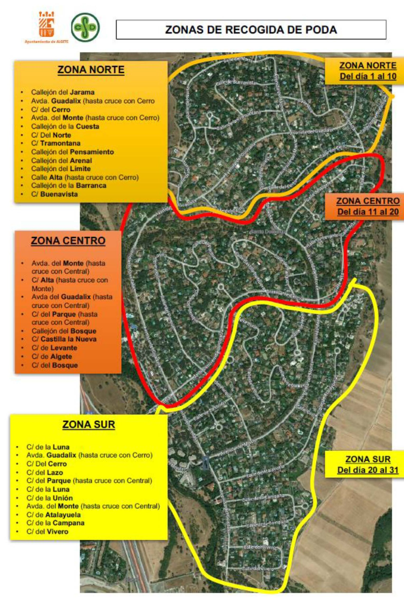

* Oficina Virtual
:PROPERTIES:
:EXPORT_FILE_NAME: tutorial-oficina-virtual
:EXPORT_TITLE: Oficina Virtual
:EXPORT_DATE: Septiembre 2026
:ETIQUETA: oficina virtual
:END:

La Oficina Virtual es el acceso privado en el que cada propietario puede
consultar los datos que figuran a su nombre en la base de datos de la
Comunidad. Darse de alta es sencillo.

Entre en [[https://ciudadsantodomingo.org][www.ciudadsantodomingo.org]] y
seleccione la opción {{{web(oficina-virtual/,*Acceso Área Privada*)}}}. Desde esa
página se entra en la plataforma y se descargan este manual y un
[[https://youtu.be/qEJ8fP5zPbc][vídeo tutorial]] con el proceso de alta.

Los propietarios no están dados de alta por defecto: debe hacerlo usted, en su
calidad de propietario, por cualquiera de estas dos vías. Al hacerlo presta su
consentimiento.

- *Alta por internet*, en la propia página (es la forma habitual). El sistema le pedirá:
  - _el número de contrato_, un número único por parcela que asigna el sistema y que se imprime en las facturas;
  - el importe de la última factura;
  - un correo electrónico, que será su nombre de usuario;
  - una contraseña que usted elija.

  El usuario es un correo electrónico para que, si olvida la contraseña, pueda recuperarla mediante un mensaje automático. Por eso es imprescindible que la Gerencia disponga de su dirección de correo electrónico.
- *Alta a través de la oficina*: la administración le da de alta y le asigna un usuario y una contraseña.

#+attr_latex: :options [Pantalla inicial]
#+begin_fotos
#+attr_latex: :width .6\linewidth :center nil :options frame

#+end_fotos

Si es la primera vez que accede, deberá registrarse. En esta pantalla puede
consultar un «tutorial» que le guía en el alta.

La segunda pantalla sirve para generar su alta con su clave de acceso
personal.

#+attr_latex: :width .6\linewidth :options frame
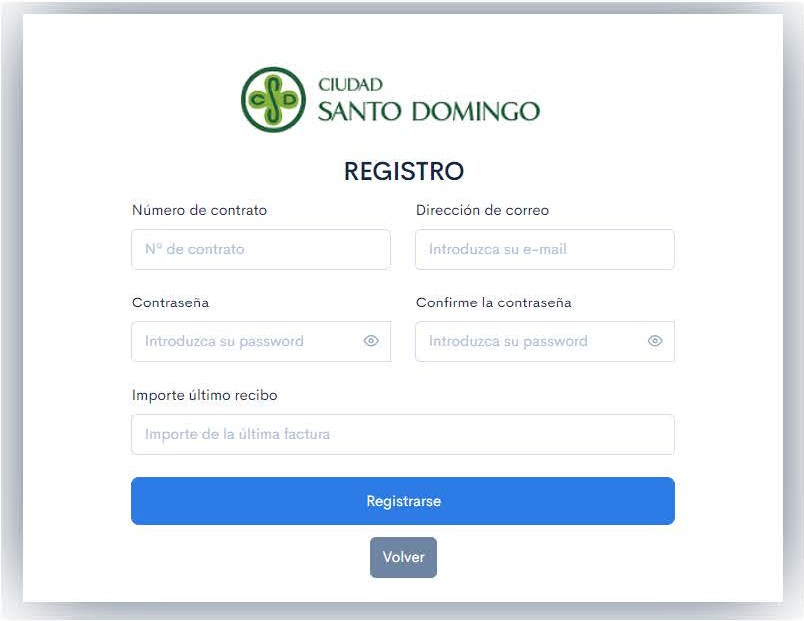

#+attr_latex: :height .66\textheight :options frame
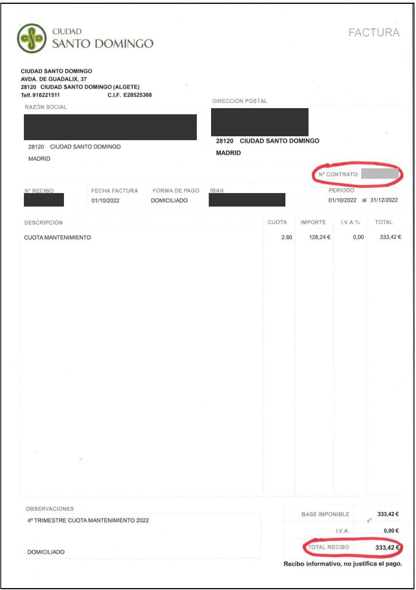

En la Oficina Virtual tiene acceso a todos los datos que figuran a su nombre
en la base de datos de la Comunidad:

- nombre, apellidos, NIF o pasaporte, teléfonos de contacto, correos electrónicos, IBAN, etc.;
- los datos de su parcela: número, superficie, etc.;
- todas las facturas emitidas a su nombre por cuotas de comunidad, término fijo, consumos de agua, etc.;
- las matrículas de sus vehículos;
- las últimas circulares y comunicaciones remitidas.

Si necesita modificar o ampliar sus datos, comuníquelo por correo electrónico
a [[mailto:csd@csdomingo.com][csd@csdomingo.com]], siempre por escrito para
que quede constancia, y la Gerencia los actualizará.

* Consejos prácticos para la vida en Ciudad Santo Domingo
:PROPERTIES:
:EXPORT_FILE_NAME: consejos-vida-comunidad
:EXPORT_TITLE: Consejos prácticos para la vida en Ciudad Santo Domingo
:EXPORT_DATE: Septiembre 2026
:ETIQUETA: consejos prácticos
:END:

#+attr_latex: :width \linewidth
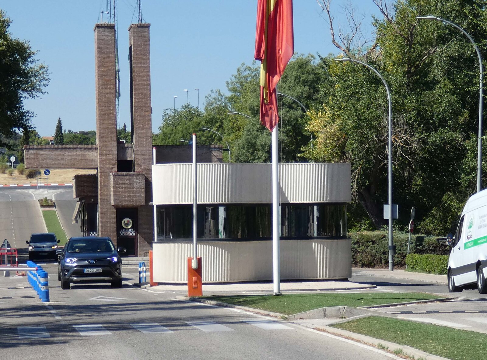

En Ciudad Santo Domingo rigen un conjunto de normas y consejos prácticos.
Algunas normas proceden de leyes de la Comunidad de Madrid o de ordenanzas del
Ayuntamiento de Algete, y son de obligado cumplimiento. Otras son
recomendaciones nacidas de la experiencia y del sentido cívico. Muchas pueden
parecer obvias, pero en una comunidad de un millar de casas, casi 4.500
vecinos y un millón y medio de vehículos al año, conviene tenerlas por
escrito.

A continuación se reseñan las principales normas y consejos para facilitar la
vida de todos en Ciudad Santo Domingo. Al final de varios consejos se enlazan
los documentos oficiales y las páginas municipales correspondientes, los mismos
que publica la web de la Comunidad, [[https://ciudadsantodomingo.org][ciudadsantodomingo.org]].

** Competencias y reclamaciones

*** 1. Competencias

*Es frecuente que haya dudas sobre qué asuntos son responsabilidad de cada institución y a quién acudir en caso de problema.*

Existe un cuadro detallado de competencias, disponible en la web y en el
compendio «Conoce Ciudad Santo Domingo». A grandes rasgos: como las calles son
de titularidad pública, todo lo que les afecta es competencia del
Ayuntamiento: asfalto, iluminación, señalización, limpieza, plantas, parques
infantiles, instalaciones deportivas, recogida de basuras, punto limpio e
islas de reciclaje, así como los permisos urbanísticos, los permisos de rodaje
o de celebración de eventos y, en general, hacer cumplir las normas de
tráfico, ruido, animales y convivencia. Algunos servicios, como la recogida de
vidrio o cartón, son mancomunados y los prestan empresas a varios municipios.
Son competencia de la Comunidad de Propietarios la red de agua de los pozos,
la depuradora y la seguridad, así como todo lo relativo a recibos
y gastos comunes. La Comunidad no tiene capacidad legal para invertir en las
vías públicas de la urbanización. El consultorio médico y los servicios
sanitarios dependen de la Comunidad de Madrid, igual que el colegio, aunque el
Ayuntamiento ofrece algunas actividades extraescolares voluntarias. La red del
Canal de Isabel II es competencia de esa empresa, y lo mismo ocurre con el
suministro eléctrico, el gas, la telefonía e internet, que corresponden a
Iberdrola y a los distintos operadores privados. Todo lo que ocurre en el
interior de su parcela es responsabilidad suya.

*** 2. Viario público

*Los cincuenta y ocho kilómetros de calles de Ciudad Santo Domingo son de titularidad pública.*

Su propiedad empieza en su valla: los frentes de parcela no son propiedad
privada. No obstante, muchos vecinos dedican esfuerzo y recursos a cuidar su
frente de parcela, y esa costumbre es bienvenida.

*** 3. Línea Verde

*Línea Verde es una aplicación para móvil y web de gran utilidad.*

Funciona en la mayoría de los municipios y permite a los vecinos comunicar a
los servicios municipales cualquier anomalía: un árbol caído, un bache,
mobiliario urbano roto, plantas que quitan visibilidad al tráfico, suciedad
acumulada, roturas de tuberías, señales deterioradas, farolas fundidas, etc.
Los servicios de inspección municipales no pueden vigilar toda la extensión
del municipio, y menos en uno tan extenso como Algete, por lo que estos avisos
son muy útiles. Todos los mensajes se procesan, se distribuyen y reciben
respuesta. La aplicación es gratuita y sencilla, geolocaliza el problema y
admite fotografías hechas con el móvil:

[[http://www.lineaverdealgete.com/][http://www.lineaverdealgete.com/]]

** Seguridad e incendios

*** 4. Policía de proximidad

*El Ayuntamiento presta un servicio de policía de proximidad.*

Una pareja de agentes con gran experiencia patrulla los cinco días laborables,
todas las mañanas y en horarios concretos de tardes, noches y fines de semana.
Puede llamarles directamente a su móvil, tanto para informar de riesgos o
incidencias como para consultas. *Policía de Proximidad: 619 300 600*

/Más información:/ [[https://aytoalgete.es/index.php?option=com_content&view=article&id=200&Itemid=666][Policía Local de urbanizaciones (Ayuntamiento de Algete)]]

*** 5. Alarmas y actividades sospechosas

*Ciudad Santo Domingo tiene uno de los índices de delincuencia (hurtos, robos, agresiones, etc.) más bajos de España.*

Aun así, es imposible reducirlos a cero. La colaboración de los vecinos con el
equipo de seguridad, la policía de proximidad y la Guardia Civil es la mejor
garantía para que Ciudad Santo Domingo siga siendo un lugar tranquilo y
seguro. Si observa una actitud extraña, como alguien fotografiando casas o
vehículos que circulan sin destino aparente, avise de inmediato a seguridad:
acudirán a hacer las comprobaciones necesarias.

La Comunidad convocó un concurso para seleccionar una empresa que instalase
una central de alarmas moderna en la propia urbanización; resultó
adjudicataria la empresa DRIN. Como la central alerta directamente a nuestro
equipo de seguridad, el tiempo de respuesta es muy corto, lo que no ocurre con
otros proveedores. Usted es libre de contratar con cualquier compañía de
alarmas, pero la relación calidad-precio de la empresa adjudicataria es muy
buena, ya que sus equipos y conexiones están instalados en la urbanización.
Alrededor del 80 % de las parcelas cuenta con alarma, lo que produce un efecto
de protección mutua y disuasión: cuantas más viviendas estén equipadas, mayor
es la seguridad colectiva. *Seguridad: 916 221 507*

/Más información:/ {{{web(docs/seguridad.pdf,dosier «Seguridad» (PDF))}}}

*** 6. Pintadas y vandalismo

*Ningún municipio está a salvo de las pintadas.*

En Ciudad Santo Domingo afectan sobre todo a las casetas de Iberdrola, las
señales de tráfico, las instalaciones deportivas y las paredes del centro
comercial. Todos estos puntos se limpian y repintan con regularidad, salvo las
casetas eléctricas: son edificios privados, el Ayuntamiento no puede actuar
sobre ellos y la Comunidad podría hacerlo con autorización de Iberdrola, pero
requeriría un presupuesto extraordinario aprobado en Asamblea. Muchos
municipios y empresas han optado por encargar murales propios, que los
grafiteros suelen respetar. En cualquier caso, si ve a alguien pintando, avise
a seguridad para que pueda ser identificado; los jueces suelen imponer a los
autores trabajos en beneficio de la comunidad. El mismo criterio vale para los
actos de vandalismo.

*** 7. Incendios

*En verano, con el calor y la falta de lluvias, el riesgo de incendio es alto.*

Por ello se aconsejan medidas estrictas de prevención: mantenga la parcela
limpia de maleza, guarde los productos inflamables en un lugar seguro y tenga
una manguera conectada permanentemente a un grifo. En caso de incendio llame
de inmediato al Control de Seguridad: su respuesta es más rápida que la de
cualquier otro dispositivo y los vigilantes, además de acudir en pocos
minutos, avisan a los bomberos. Un fuego que toma fuerza puede arrasar
cualquier vivienda.

*** 8. Fogatas

*Está totalmente prohibida la quema de cualquier tipo de material, también en las obras.*

Si hace barbacoas, hágalo con todas las precauciones y con los dispositivos
diseñados para ello, nunca con fuego directamente sobre el suelo.

*** 9. Desbroce de parcelas

*Toda parcela no edificada o no habitada debe desbrozarse en primavera.*

El desbroce es una medida de protección contra incendios, cada vez más
necesaria. La Comunidad facilita este servicio. Si una parcela no se desbroza,
el Ayuntamiento puede actuar de oficio y sancionar al propietario.

/Más información:/ {{{web(docs/desbroce-parcelas.pdf,Bando municipal sobre desbroce de parcelas (PDF))}}}

** Seguridad vial

*** 10. Limitación de velocidad

*Ciudad Santo Domingo es una zona residencial y las normas de tráfico son claras.*

Un vehículo potente no da derecho a circular a cualquier velocidad, y el
exceso no es exclusivo de los coches de gran cilindrada: afecta a muchos
conductores y, de forma notoria, a las furgonetas de reparto. En la
urbanización se han producido atropellos graves de peatones y son frecuentes
los de perros, gatos y ardillas, así como las quejas de vecinos que han tenido
que apartarse de algún vehículo mientras paseaban, a menudo con niños,
personas mayores o en bicicleta. Respetar los límites de velocidad es una de
las obligaciones que más se incumplen. No se trata de evitar sanciones, sino
de conciencia cívica y sentido común: entre una velocidad peligrosa y una
adecuada se ganan apenas unos segundos.

*** 11. Conducción bajo los efectos del alcohol y las drogas

*El alcohol y otras sustancias también provocan accidentes dentro de la urbanización.*

Estar cerca de casa no exime de la obligación de no conducir en esas
condiciones.

*** 12. Acceso a la urbanización

*El acceso a la urbanización está vigilado permanentemente por el servicio de seguridad.*

Ciudad Santo Domingo es, no obstante, un espacio público urbano como cualquier
otro barrio, y el acceso es libre. El sistema de seguridad graba las
matrículas de todos los vehículos que entran, más de un millón al año, lo que
permite actuar con rapidez y cerrar las barreras ante una emergencia o alerta.
La puerta de Vivero permanece normalmente cerrada y se abre a petición. En el
cruce situado pasado el control son frecuentes los alcances entre vehículos:
no pierda la concentración y respete el stop y las preferencias.

*** 13. Coches aparcados y abandonados

*Prácticamente todas las parcelas tienen acceso privado y garaje.*

Aparque dentro de su parcela siempre que sea posible: las calles son estrechas
y los coches aparcados dificultan el paso, sobre todo a los peatones. No
abandone vehículos en la vía pública ni los deje aparcados mucho tiempo sin
usar, especialmente remolques y caravanas.

** Gestión de residuos y limpieza

*** 14. Residuos orgánicos

*Los residuos orgánicos se depositan en el cubo de cada parcela, siempre dentro de una bolsa.*

Así se facilita la recogida municipal, que es mecánica, y el tratamiento
posterior. Los operarios de la contrata pueden no retirar un cubo si la basura
no cumple las normas.

/Más información:/ [[http://www.aytoalgete.es/images/reglamentos_ordenanzas/Modificacion_Ordenanza_Residuos.pdf][Ordenanza municipal de residuos (PDF, Ayuntamiento de Algete)]]

*** 15. Césped

*La siega de césped tiene tratamiento de residuo sólido urbano, igual que los restos de comida.*

Debe ir en bolsa de basura y dentro del cubo. El césped, normalmente húmedo,
pesa demasiado si se deposita suelto, y los cubos tienden a romperse.

*** 16. Reposición de cubos

*Cada parcela tiene derecho a un cubo nuevo cada diez años sin coste.*

Si el cubo se rompe por la manipulación de la contrata de recogida, el
Ayuntamiento también lo repone. La solicitud se cursa en la Tenencia de
Alcaldía de Ciudad Santo Domingo, *916 220 406*.

/Más información:/ [[https://aytoalgete.es/index.php?option=com_content&view=article&id=175&Itemid=628][Tenencia de Alcaldía (Ayuntamiento de Algete)]]

*** 17. Cubos en el interior de las parcelas

*La normativa municipal prohíbe dejar los cubos permanentemente en la calle.*

Guárdelos dentro de la parcela hasta la noche anterior a la recogida. Fuera
del horario nocturno de recogida, los cubos en la calle afean la urbanización
y estorban al tráfico y a los peatones.

/Más información:/ [[http://www.aytoalgete.es/images/reglamentos_ordenanzas/Modificacion_Ordenanza_Residuos.pdf][Ordenanza municipal de residuos (PDF, Ayuntamiento de Algete)]]

*** 18. Recogida de poda mediante sacas normalizadas

*El recorte de setos y la poda en general se ajustan al protocolo de recogida de poda del Ayuntamiento.*

La campaña de poda suele ir de noviembre a abril. Los restos vegetales se
depositan en las sacas normalizadas de 1 m³ que suministra gratuitamente el
Ayuntamiento; se solicitan en la Tenencia de Alcaldía (*916 220 406*) y se
recogen en el Punto Limpio. Es fundamental respetar los días de recogida de
cada zona: cada propietario saca las sacas delante de su parcela solo en la
decena del mes que corresponde a su zona. Así se evitan los montones de poda
en las calles durante largos periodos. El sistema de sacas se implantó en 2022
con resultado satisfactorio.

/Más información:/ {{{web(docs/recogida-podas.pdf,«Procedimiento de recogida de podas» (PDF))}}} · [[http://www.aytoalgete.es/images/reglamentos_ordenanzas/Modificacion_Ordenanza_Residuos.pdf][Ordenanza municipal de residuos (PDF, Ayuntamiento de Algete)]]

*** 19. Tala de árboles

*La tala de árboles está regulada por la normativa medioambiental de la Comunidad de Madrid.*

Estas normas protegen el patrimonio natural de la región. Para talar un árbol,
aunque esté dentro de su parcela, debe pedir autorización previa al
departamento de Medio Ambiente del Ayuntamiento de Algete (*916 204 900,
extensión 4010*). Talar sin autorización puede acarrear multas muy cuantiosas.
A diferencia de la poda, la tala es responsabilidad íntegra de cada
propietario: si contrata a una empresa, a ella le corresponde transportar los
restos a un vertedero autorizado; si la hace por sus medios, deberá llevar los
restos al Punto Limpio de Vivero respetando los volúmenes admitidos por
entrega. El servicio municipal no retira la tala en ningún caso.

/Más información:/ [[https://aytoalgete.es/index.php?option=com_content&view=article&id=175&Itemid=628][Tenencia de Alcaldía (Ayuntamiento de Algete)]]

*** 20. Punto Limpio

*Ciudad Santo Domingo cuenta con un Punto Limpio.*

En él se entregan los residuos y objetos que no son basura doméstica ni pueden
depositarse en las islas de reciclaje: muebles, electrodomésticos, restos de
obra, aceites, aparatos electrónicos, maderas, juguetes de plástico, etc. Está
junto al parque de Vivero y abre en horario limitado, que incluye fines de
semana y festivos. Quien entregue materiales debe identificarse con el DNI,
para evitar que lo saturen empresas de construcción o reformas o vecinos de
otras urbanizaciones.

/Más información:/ [[https://aytoalgete.es/index.php?Itemid=520&catid=89%3Aservicios&id=166%3Arecogida-residuos&option=com_content&view=article][Puntos limpios y recogida de residuos (Ayuntamiento de Algete)]]

*** 21. Islas de reciclaje

*La urbanización cuenta con varias islas de reciclaje, repartidas para acortar las distancias desde cada parcela.*

En ellas se depositan tres tipos de residuos, cada uno en su contenedor de
color: papel y cartón, plásticos y envases, y vidrio. En el contenedor de
vidrio solo se admite vidrio hueco (botellas, vasos, etc.); el vidrio plano
(ventanas, puertas, encimeras) se entrega en el Punto Limpio. Los contenedores
los vacían empresas especializadas en cada material, de ámbito supramunicipal,
que además tratan los residuos; no lo hace el Ayuntamiento. Cada empresa
retira solo su material, incluido el que exceda la capacidad del contenedor, y
nunca una silla, un colchón o un saco de escombros. Los objetos abandonados
fuera de los contenedores los retira cada mañana la empresa municipal GESERAL;
lo que se deposite después permanece en la calle hasta el día siguiente, salvo
que sea un material peligroso.

*** 22. No depositar nada fuera de los contenedores

*Está terminantemente prohibido abandonar objetos fuera de los contenedores.*

Los colchones, muebles, cajas o bolsas de basura que a veces aparecen junto a
las islas deben llevarse al Punto Limpio. Abandonarlos perjudica a los vecinos
y resta tiempo a los servicios de limpieza viaria, porque las contratas de
reciclaje no pueden retirarlos. Si ve a alguien abandonando objetos,
comuníquelo a seguridad. Transmita estas instrucciones al personal a su cargo
que suela llevar los residuos a las islas, y compruebe que las cumple.

/Más información:/ [[http://www.aytoalgete.es/images/reglamentos_ordenanzas/Modificacion_Ordenanza_Residuos.pdf][Ordenanza municipal de residuos (PDF, Ayuntamiento de Algete)]]

*** 23. Mantenimiento de las calles

*La limpieza de las calles y la jardinería pública corresponden al Ayuntamiento.*

El Ayuntamiento de Algete tiene destacado en la urbanización un equipo estable
de once personas que trabaja cada día laborable. Aun así, Ciudad Santo Domingo
tiene 28 km de calles, y la dotación de recursos municipales para su
mantenimiento es un asunto permanente de conversación entre la Comunidad y los
sucesivos equipos de gobierno. Por eso la colaboración de los vecinos es
importante: no tire latas, papeles, bolsas ni restos de comida a la calle. Las
calles se limpian con regularidad, pero un residuo puede permanecer días en el
suelo, sobre todo entre plantas o en lugares poco accesibles.

** Respeto colectivo

*** 24. Ruidos

*El ruido está regulado por la ordenanza municipal correspondiente.*

Conózcala y respétela. En todo caso, se aconseja limitar al máximo los ruidos,
siempre dentro de la norma, de lunes a viernes de 20:00 a 8:00 h, los sábados
a partir de las 14:00 h y los domingos y festivos durante todo el día. Las
sanciones por ruido pueden ser muy elevadas.

/Más información:/ [[http://www.aytoalgete.es/images/reglamentos_ordenanzas/BOCM%20Ordenanza%20de%20ruidos%20Algete.pdf][Ordenanza municipal de ruidos (PDF, Ayuntamiento de Algete)]]

*** 25. Fiestas

*Las fiestas en las parcelas deben respetar las normas de ruido y el horario de descanso, entre las 23:00 y las 7:00 h.*

Si organiza un evento que pueda generar ruidos excesivos o molestos, debe
pedir autorización al Ayuntamiento y, en cualquier caso, terminar a las 24:00
h.

/Más información:/ [[http://www.aytoalgete.es/images/reglamentos_ordenanzas/BOCM%20Ordenanza%20de%20ruidos%20Algete.pdf][Ordenanza municipal de ruidos (PDF, Ayuntamiento de Algete)]]

*** 26. Petardos y fuegos artificiales

*Los fuegos artificiales están prohibidos.*

Requieren permisos especiales y empresas acreditadas; los eventos pirotécnicos
los organizan los ayuntamientos con motivo de festejos. Un particular nunca
debe lanzarlos. Además del riesgo de incendio, causan gran sufrimiento a la
mayoría de los animales domésticos, cuyo oído, mucho más sensible que el
humano, los percibe como una amenaza. En Ciudad Santo Domingo viven más de
quinientos perros y otros tantos gatos en domicilios particulares.

*** 27. Conflictos urbanísticos y licencias de obras

*Las obras y los lindes son una fuente habitual de conflictos entre vecinos.*

Una valla vencida, un depósito de tierras que inunda la parcela contigua,
árboles que rebasan los lindes, garajes o edificaciones que no los respetan...
Estos conflictos suelen acabar en los tribunales y suponen un gran desgaste
para los vecinos afectados; un acuerdo de buena voluntad casi siempre es mejor
que un pleito. Recuerde que las normas urbanísticas son claras y que cualquier
obra necesita licencia municipal, lo que evita muchos conflictos. Si sospecha
que una actuación en su parcela puede perjudicar a su vecino, consúltelo con
él. Las soluciones de consenso conviene reflejarlas por escrito entre ambos
propietarios, para que un futuro propietario quede protegido por ese acuerdo.

/Más información:/ [[https://aytoalgete.es/index.php?option=com_content&view=article&id=175&Itemid=628][Tenencia de Alcaldía (Ayuntamiento de Algete)]]

*** 28. Drones

*Ciudad Santo Domingo se encuentra en un área afectada por el aeropuerto de Madrid-Barajas. El vuelo de drones está totalmente prohibido.*

Para volar un dron hace falta una titulación de piloto de drones y, en el caso
de Ciudad Santo Domingo, una autorización especial, ya que la urbanización
está en zona de servidumbre del aeropuerto. Los vecinos se sienten molestos
cuando un dron sobrevuela sus casas, porque viola la intimidad del domicilio.

*** 29. Rodajes

*Los rodajes de cine y series son frecuentes en Ciudad Santo Domingo.*

Requieren un permiso de la Policía Local de Algete y el pago de unas tasas. La
molestia para los vecinos se debe sobre todo a la ocupación de las calles por
los camiones auxiliares. Los rodajes están permitidos en las vías públicas de
cualquier municipio y, aunque suponen una incomodidad transitoria y
normalmente breve, dan a conocer la zona y benefician al propietario que
alquila su casa. Cuestión distinta es convertir una parcela en un plató
permanente: eso es una actividad industrial y está totalmente prohibida.

*** 30. Actividades profesionales

*Ciudad Santo Domingo tiene la consideración urbanística de área residencial.*

Es, por tanto, incompatible con cualquier actividad industrial, comercial,
hotelera, hospitalaria, de culto, etc., no autorizada expresamente por los
Estatutos, salvo en las zonas habilitadas para ello. Sí está permitido ejercer
una actividad profesional en una parte de la vivienda (un despacho de abogado,
consultor, diseñador, etc.), pero no instalar, por ejemplo, un bufete. Si
conoce alguna propiedad que incumpla este criterio, comuníquelo a la Comunidad
de Propietarios.

*** 31. Riego de los frentes de parcela

*Es costumbre mantener cuidados los frentes de parcela.*

Aunque no es obligatorio, regar las plantas del viario público situadas en el
frente de su parcela es una ayuda muy bienvenida.

*** 32. Pérdidas de agua

*Si observa un charco persistente donde normalmente no hay agua, o agua brotando, avise a seguridad: 916 221 511.*

Seguridad avisará de inmediato al personal de mantenimiento de la red de agua.
Avise también si la fuga procede del interior de una parcela.

** Animales

*** 33. Ordenanza municipal en materia de animales

*El Ayuntamiento de Algete cuenta con una detallada Ordenanza de Animales.*

Los animales, sean mascotas o vivan en libertad, reciben una atención
constante de los ayuntamientos. En Algete rige la Ordenanza Reguladora de la
Tenencia y Protección de Animales, publicada en el BOCM n.º 300 de 17 de
diciembre de 2021, de acceso público. Su principio fundamental es la
prohibición absoluta de cualquier acto de maltrato, crueldad o práctica que
pueda producir sufrimiento, daños o muerte a los animales. Es muy recomendable
leerla, porque regula prácticamente todas las situaciones que pueden darse con
animales domésticos o libres: tenencia en el domicilio y otros espacios
privados; documentación del propietario; colaboración con la administración;
controles sanitarios, identificación y seguros; observación antirrábica y
agresiones; animales potencialmente peligrosos; animales silvestres, exóticos
y de explotación; animales abandonados, extraviados y vagabundos; colonias de
gatos ferales; animales heridos, enfermos y muertos; desalojo y retirada de
animales; centros y empresas de animales de compañía; prohibiciones generales;
inspecciones, infracciones y sanciones.

/Más información:/ [[http://www.aytoalgete.es/images/reglamentos_ordenanzas/BOCM_ORDENANZA_TENENCIA_ANIMALES_2021.pdf][Ordenanza municipal de tenencia y protección de animales (PDF, Ayuntamiento de Algete)]]

*** 34. Perros y gatos sueltos

*Las ordenanzas municipales no permiten perros sueltos en la vía pública.*

Suponen un peligro para las personas, para el tráfico y para las propias
mascotas. Pasee a su perro atado y, si se queda solo durante el día, asegúrese
de que no pueda escaparse.

El Ayuntamiento tiene contratada una empresa de recogida de animales
abandonados y perdidos, que los traslada a una instalación específica de la
que pueden recuperarse pagando unas tasas considerables. La ley actual
establece el sacrificio cero: ningún animal perdido o abandonado es
sacrificado. Si no puede o no quiere seguir cuidando de su mascota, nunca la
abandone: es maltrato animal y está penado por la ley. Hay organizaciones y
redes que facilitan su adopción.

*** 35. Ladridos molestos

*Los perros que ladran en exceso son motivo frecuente de quejas entre vecinos.*

Evite dejar solos a los perros en la parcela durante mucho tiempo y, si son
propensos a ladrar, procure que por la noche no molesten a los vecinos.

*** 36. Excrementos

*El propietario de cada animal es responsable de recoger sus excrementos.*

Lleve siempre consigo una bolsa para retirarlos, como establece la ordenanza.

*** 37. Alimentación de gatos

*En Ciudad Santo Domingo existe una colonia importante de gatos asilvestrados.*

Las asociaciones de amigos de los animales y el Ayuntamiento realizan de forma
continuada tareas de captura y esterilización. Si desea alimentarlos, debe
obtener el carné de alimentador de animales, que el Ayuntamiento expide
gratuitamente en la Tenencia de Alcaldía. Con él acredita su derecho a
hacerlo.

** Sanidad

*** 38. Consultorio de la Seguridad Social

*Ciudad Santo Domingo cuenta con un consultorio de atención primaria de la Seguridad Social.*

Abre de lunes a viernes, de 8:30 a 14:00 h, atendido por un médico y personal
de enfermería. Es necesario pedir cita previa: por teléfono en el *916 182
454*, aunque las líneas suelen estar saturadas, o, preferiblemente, en la
aplicación Cita Sanitaria de la Comunidad de Madrid o en la web
[[https://www.comunidad.madrid/servicios/salud/cita-sanitaria][comunidad.madrid/servicios/salud/cita-sanitaria]].
El consultorio depende de la Comunidad de Madrid, no del Ayuntamiento ni de la
Comunidad de Propietarios.

/Más información:/ [[https://www.libreeleccion.sanidadmadrid.org/Seleccione/CentroAtencionPrimaria.aspx/2214?CONS-SANTO-DOMINGO/][Consultorio de Santo Domingo (Comunidad de Madrid)]]

*** 39. Centro médico privado

*Ciudad Santo Domingo cuenta también con un centro médico privado.*

Está en la zona sur del centro comercial, frente a la iglesia, trabaja con
diversas sociedades médicas (Adeslas/SegurCaixa, Sanitas, etc.) y atiende
también consultas privadas. Ofrece medicina general, pediatría, traumatología,
dermatología, psicología, radiología, urología, podología, nutrición y
dietética, ginecología, oftalmología y fisioterapia, entre otras
especialidades, además de enfermería.
[[https://www.centromedicosantodomingo.com/es/][centromedicosantodomingo.com]]
*Tel. 918 319 219*

** Nota final: repercusión a terceros

*** 40. Extensión a trabajadores e inquilinos

*La mayoría de estos consejos y normas afectan también a terceros.*

Al personal que trabaja en las casas, sea servicio doméstico o profesionales
(jardineros, fontaneros, albañiles, pintores, electricistas, etc.), y a los
inquilinos. Si es usted propietario, haga de enlace con estas personas:
infórmeles y pídales que respeten las normas y costumbres de Ciudad Santo
Domingo.

* Conoce Ciudad Santo Domingo
:PROPERTIES:
:EXPORT_FILE_NAME: conoce-csd
:EXPORT_LATEX_CLASS: csd-compendio
:END:

# Compendio. Cada ** es un capítulo con portadilla (salvo :PORTADILLA: no).
# Los capítulos que también son dosieres sueltos NO se copian: se incluyen con
# #+INCLUDE desde su propio subárbol, así se editan en un solo sitio.
# Las partes se marcan con  #+latex: \csdparte{…}  al final del capítulo previo.

** Carta del presidente
:PROPERTIES:
:PORTADILLA: no
:END:

Estimado copropietario:

Ciudad Santo Domingo es un gran sitio para vivir. Fundada en 1976 sobre 702
hectáreas del municipio de Algete, con cerca de un millar de casas y más de
28 km de calles, nuestra urbanización es, junto con otras de gran prestigio,
un referente en la Comunidad de Madrid.

En los últimos años se ha producido un relevo generacional, con la
incorporación cada año de un número significativo de nuevos propietarios, por
lo general familias jóvenes que optan por compartir nuestro estilo de vida.

Desde la Junta de la Comunidad de Propietarios constatamos que muchos de los
nuevos propietarios no conocen en detalle la urbanización ni los servicios
comunes que presta. Por ello se ha elaborado el documento que sigue a esta
carta, «Conoce Ciudad Santo Domingo». Está escrito desde una perspectiva
práctica y sirve de ayuda no solo a los nuevos vecinos, sino también a quienes
llevamos muchos años aquí.

El documento explica qué asuntos son competencia de la urbanización y cuáles
dependen del Ayuntamiento de Algete o de la Comunidad de Madrid; describe los
servicios que gestiona la Comunidad de Propietarios, como el suministro y la
depuración del agua de nuestra concesión de pozos o el sistema de seguridad;
recoge los Estatutos y el Reglamento de la Asamblea; y ofrece una sección de
consejos prácticos para la vida en la urbanización y un directorio de
teléfonos de interés. Toda esta información está también en nuestra web,
[[https://ciudadsantodomingo.org][ciudadsantodomingo.org]].

En representación de la Junta, le transmito un cordial saludo.

#+begin_flushright
El Presidente de la Comunidad de Propietarios
#+end_flushright

** Directorio de servicios
:PROPERTIES:
:PORTADILLA: no
:END:

*** Teléfonos de interés

#+attr_latex: :align p{.62\linewidth}r
| Control de seguridad                                                                                                                                    | *916 221 507* |
| Oficinas de la Comunidad                                                                                                                                | *916 221 511* |
| [[https://www.aytoalgete.es/index.php?option=com_k2&view=itemlist&task=tag&tag=polic%C3%ADa+local&Itemid=455][Policía Local]]                                       | *916 280 137* |
| [[https://aytoalgete.es/index.php?option=com_content&view=article&id=200&Itemid=666][Policía de Proximidad]]                                               | *659 625 379* |
| [[https://www.cylex.es/ciudad-santo-domingo/farmacia-santo-domingo-11359876.html][Farmacia]]                                                            | *916 221 233* |
| [[https://www.correosoficinas.es/piscinas/oficina-2812001-ciudad-santo-domingo/][Correos]]                                                             | *916 222 193* |
| [[https://parroquiasantodomingo.org/][Parroquia]]                                                                                                       | *916 221 493* |
| [[https://www.comunidad.madrid/centros/centro-salud-algete][Centro de Salud Algete]]                                                                    | *916 282 286* |
| [[https://www.centrosantodomingo.com/contacto/][Oficina del centro comercial]]                                                                          | *916 220 800* |
| [[https://aytoalgete.es/index.php?option=com_content&view=article&id=175&Itemid=628][Tenencia de Alcaldía]]                                                | *916 220 406* |
| [[https://aytoalgete.es/][Ayuntamiento de Algete]]                                                                                                       | *916 204 900* |
| [[https://www.redtransporte.com/madrid/autobuses-interurbanos/171-madrid-san-sebastian-de-los-reyes-algete.html][Línea 171 de autobús]]                    | *911 779 951* |

*** Otros servicios

El [[https://www.centrosantodomingo.com/][Centro Comercial]] publica su propio [[https://www.centrosantodomingo.com/directorio/][directorio de comercios y servicios]], que es la referencia actualizada para restauración, salud privada, estética, alimentación, comercios, automóvil, inmobiliarias, banca y seguros.

#+INCLUDE: "./documentos.org::*Consejos prácticos para la vida en Ciudad Santo Domingo" :minlevel 2

** Tabla de competencias principales
:PROPERTIES:
:PORTADILLA: no
:END:

#+begin_center
*¿Qué corresponde a quién?*
#+end_center

#+attr_latex: :environment longtable :align p{.29\linewidth}p{.33\linewidth}p{.29\linewidth} :font \small
| *Comunidad de Propietarios*                              | *Ayuntamiento de Algete*                              | *Otras entidades proveedoras*                          |
|----------------------------------------------------------+-------------------------------------------------------+--------------------------------------------------------|
| Red de pozos, agua, aguas residuales y depuradora (EDAR) | Gestiones en Tenencia de Alcaldía (padrón, registro)  | Iglesia: Cáritas Diocesana                             |
| Oficinas de administración y facturación                 | Policía Municipal y de Proximidad                     | Suministro de agua: CYII                               |
| Mantenimiento de pluviales soterradas                    | Alumbrado público                                     | Suministro eléctrico: Iberdrola                        |
| Pantalla LED para anuncios                               | Mantenimiento viario                                  | Telefonía: Telefónica, Movistar, Orange                |
| Seguridad privada: patrullas y vigilancia                | Parques infantiles y zonas verdes                     | Residencia de mayores y apartamentos asistidos         |
| Página web                                               | Mantenimiento de pluviales en superficie y cunetas    | Club deportivo                                         |
| Plantas generadoras fotovoltaicas                        | Recogida de residuos sólidos urbanos                  | Centro comercial y comercios                           |
| Teléfono de emergencias del Control                      | Recogida de poda                                      | Río y riberas: Confederación Hidrográfica del Tajo     |
|                                                          | Recogida en puntos de acopio de reciclaje             | Accesos desde la A-1: Ministerio de Fomento            |
|                                                          | Punto limpio (c/ Vivero)                              | Asociación contra el ruido de aviones                  |
|                                                          | Mantenimiento plantas, alcorques, riego, poda         | Cooperativa del gas                                    |
|                                                          | Señalización y regulación del tráfico                 | Colegio público: Comunidad de Madrid                   |
|                                                          | Ordenanza de animales                                 | Consultorio: sociedades médicas privadas               |
|                                                          | Recogida de animales (Maycan)                         | Asistencia primaria de la Seguridad Social             |
|                                                          | Ordenanzas urbanísticas y licencias de obra           | Asociación de animales                                 |
|                                                          | Autorizaciones de tala de árboles                     | Movimiento Scouts                                      |
|                                                          | Autorizaciones de actividades en vía pública          | Asociación cultural                                    |
|                                                          | Línea Verde App                                       | Asociación artística                                   |
|                                                          | Asfaltado                                             |                                                        |

** Nuestra urbanización

*Ciudad Santo Domingo* es una urbanización situada al noreste de Madrid, con
acceso directo desde la autovía del Norte (*A-1*, *salida del km 28*). Fue
fundada en 1976 por un grupo de ingenieros de caminos, cuyo patrón, Santo
Domingo de la Calzada, le da nombre. Aquel planteamiento técnico y
urbanístico explica el conjunto residencial de hoy: *cerca de un millar de
chalets independientes* entre encinares y amplias zonas verdes.

La urbanización cuenta con *servicio de seguridad propio las 24 horas, los
365 días del año*, control de accesos automatizado y vigilancia perimetral. Lo
complementa una *patrulla de proximidad de la Policía Local* de Algete.

#+begin_fotos
#+attr_latex: :width .48\linewidth :center nil
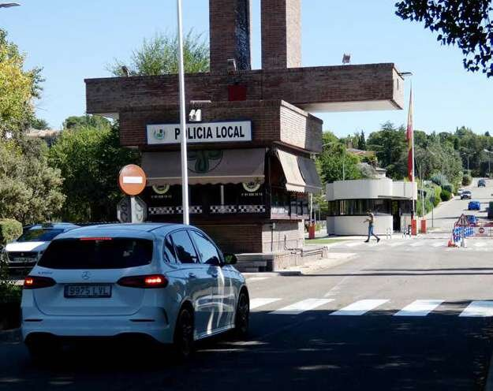 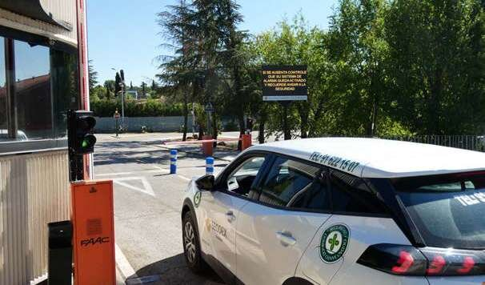
#+end_fotos

La Comunidad dispone de una *red propia de captación, distribución y
depuración de agua*, alimentada por pozos propios, automatizada y abastecida
en parte con energía solar fotovoltaica. Una segunda red, independiente,
suministra el agua de consumo del *Canal de Isabel II*.

Los residentes disponen de un *punto limpio* de uso exclusivo y de un servicio
de *recogida de restos de poda*, ambos de titularidad municipal.

#+begin_fotos
#+attr_latex: :width .48\linewidth :center nil
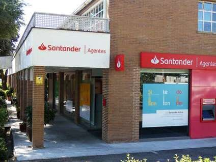 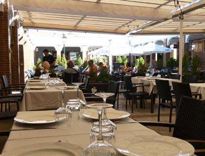
#+end_fotos

#+begin_fotos
#+attr_latex: :width .48\linewidth :center nil
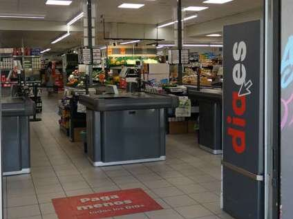 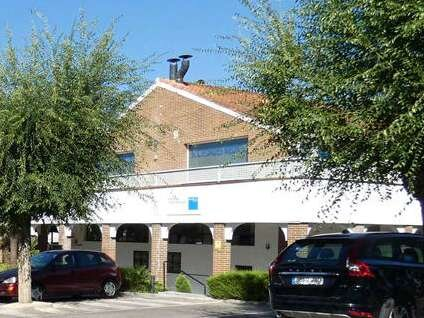
#+end_fotos

#+begin_fotos
#+attr_latex: :width .58\linewidth :center nil
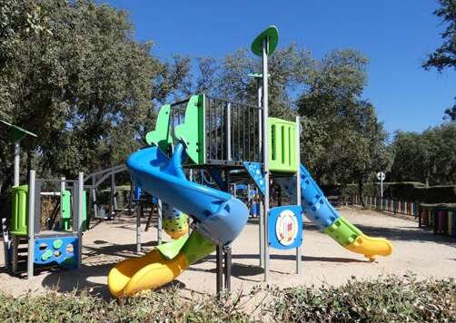
#+end_fotos

La *zona comercial*, dentro de la propia urbanización, reúne supermercado,
frutería, pescadería, entidad bancaria, oficina de Correos, consultorio de
seguros médicos, clínica veterinaria, despachos profesionales, el consultorio
de atención primaria de la Seguridad Social y varios restaurantes y
cafeterías con terraza. El centro comercial publica su propio
[[https://www.centrosantodomingo.com/directorio/][directorio de comercios y servicios]].

La *parroquia de Santo Domingo de la Calzada* tiene su templo dentro de la
urbanización, y el Ayuntamiento de Algete mantiene en ella una *Tenencia de
Alcaldía* que permite realizar trámites municipales sin desplazarse.

#+begin_fotos
#+attr_latex: :width .32\linewidth :center nil
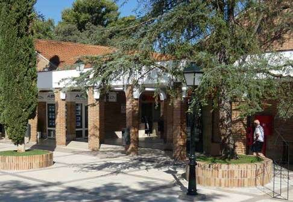 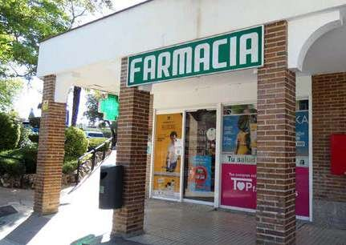 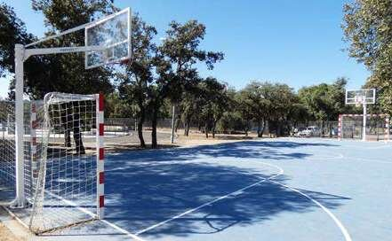
#+end_fotos

La urbanización conserva *parques y amplios encinares*, cuenta con un camino
ecológico circular para pasear o hacer deporte, y con zonas de juego que
incluyen *parque infantil, canchas multideporte y skate park*.

La Comunidad de Propietarios está gobernada por una *Junta Gestora* elegida
por la *Asamblea General*. La Gerencia atiende a los propietarios en sus
oficinas durante todo el año.

#+attr_latex: :width .8\linewidth
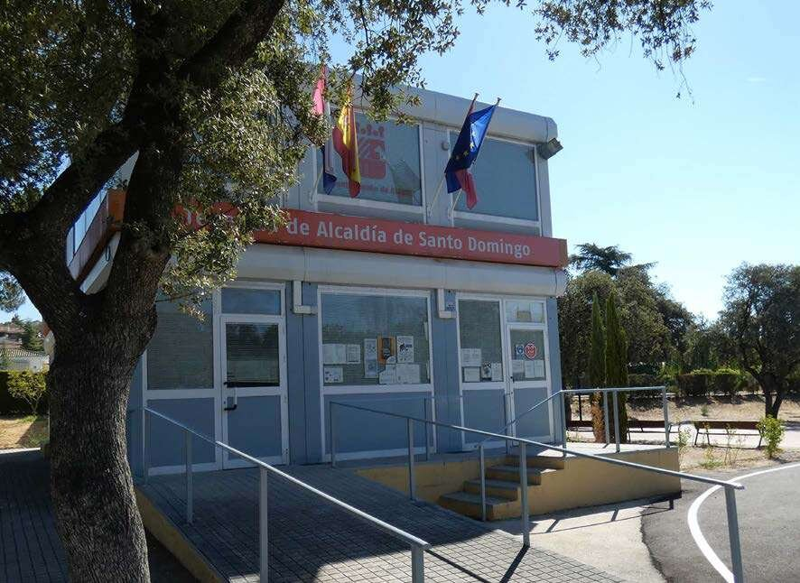

#+latex: \newpage
#+attr_latex: :height .46\textheight
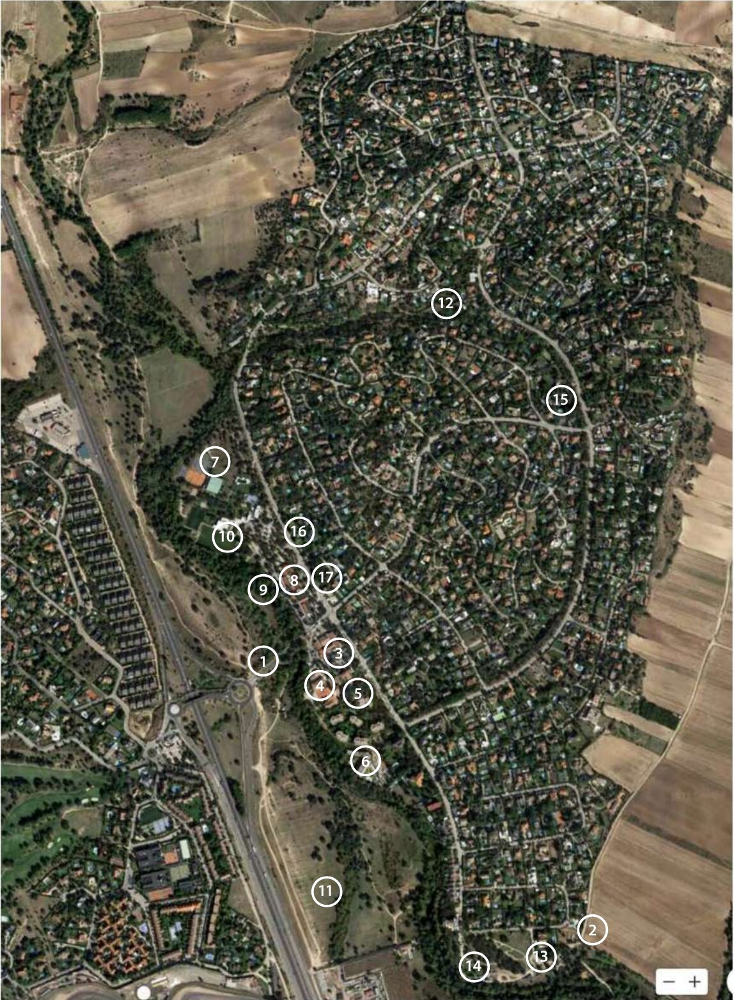

1. Acceso a la urbanización desde la A-1. Caseta de control y caseta de la
   Policía Local
2. Acceso por la Calle Vivero
3. Zona Comercial: Tiendas, supermercado, farmacia, banco, restaurantes,
   Consultorio salud privado, etc. Norte y Sur
4. Iglesia. Parroquia de Santo Domingo y de la Inmaculada Concepción
5. CEIP Santo Domingo. Colegio Público
6. Residencia ORPEA de Mayores y apartamentos asistidos
7. Club Deportivo
8. Oficina de Correos
9. Consultorio de la Seguridad Social. Atención Primaria
10. Parque Skate e instalaciones deportivas
11. Parque de Vivero
12. Parque de la Barranca
13. Depuradora EDAR e Instalación Fotovoltaica
14. Punto Limpio
15. Depósito Central de agua e Instalación Fotovoltaica
16. Tenencia de Alcaldía. Ayuntamiento de Algete
17. Oficinas de la Comunidad de Propietarios

#+latex: \newpage
#+attr_latex: :height .56\textheight
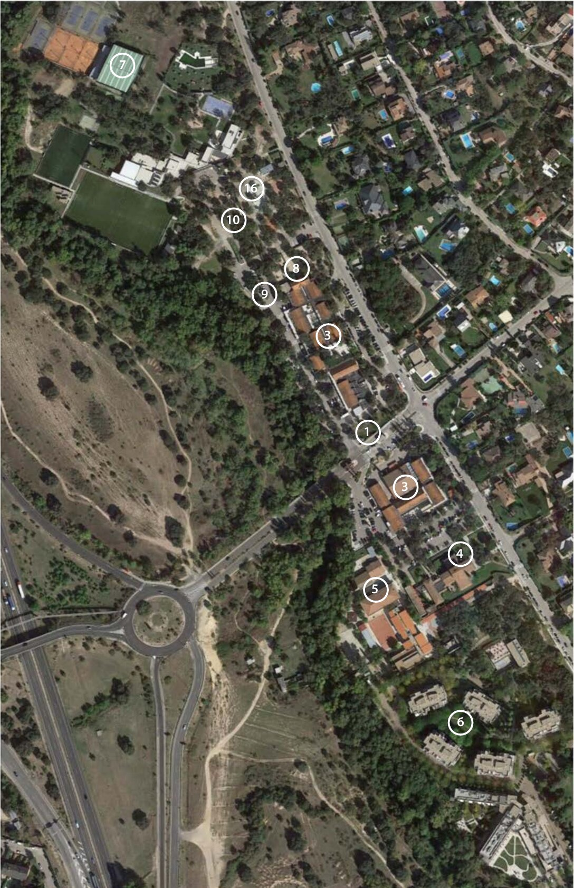

1. Acceso a la urbanización desde la A-1. Caseta de control y caseta de la
   Policía Local
3. [@3] Zona Comercial: Tiendas, supermercado, farmacia, banco, restaurantes,
   Consultorio salud privado, etc. Norte y Sur
4. Iglesia. Parroquia de Santo Domingo y de la Inmaculada Concepción
5. CEIP Santo Domingo. Colegio Público
6. Residencia ORPEA de Mayores y apartamentos asistidos
7. Club Deportivo
8. Oficina de Correos
9. Consultorio de la Seguridad Social. Atención Primaria
10. Parque Skate e instalaciones deportivas
16. [@16] Tenencia de Alcaldía. Ayuntamiento de Algete
17. Oficinas de la Comunidad de Propietarios

#+latex: \newpage
#+attr_latex: :height .56\textheight
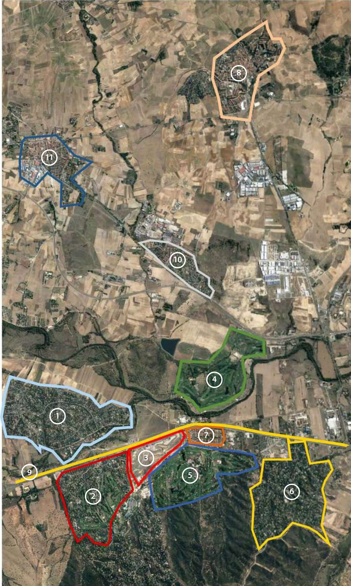

1. Ciudad Santo Domingo
2. Urbanización Ciudalcampo. RACE. Club de Golf
3. Circuito del Jarama
4. Club de Golf La Moraleja
5. Urbanización Fuente del Fresno
6. Real Sociedad Hípica Española Club de Campo
7. Urbanización Club de Campo
8. Casco Urbano Algete
9. A-1, salida 28
10. Urbanización Prado Norte
11. Fuente el Saz de Jarama

** Historia de Ciudad Santo Domingo

*** Historia

Ciudad Santo Domingo se fundó en 1976 por iniciativa de un grupo de ingenieros
de caminos; de ahí su nombre, en honor a su patrón, Santo Domingo de la
Calzada.

Se empezó a poblar a principios de los años setenta, y con rapidez: los nuevos
propietarios estaban obligados a construir en el primer año, para evitar la
compra especulativa de parcelas. Está totalmente desarrollada desde mediados
de los ochenta.

#+attr_latex: :width .75\linewidth
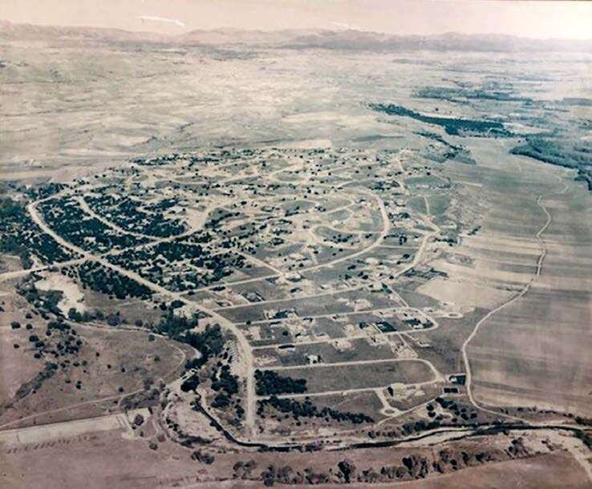

*** Ubicación

Ciudad Santo Domingo está en el km 28 de la A-1, con acceso directo desde la
autovía, frente al Circuito del Jarama, a 17 km del aeropuerto, a 16 km de
Algete y a 5 km de San Agustín del Guadalix.

#+attr_latex: :width .75\linewidth
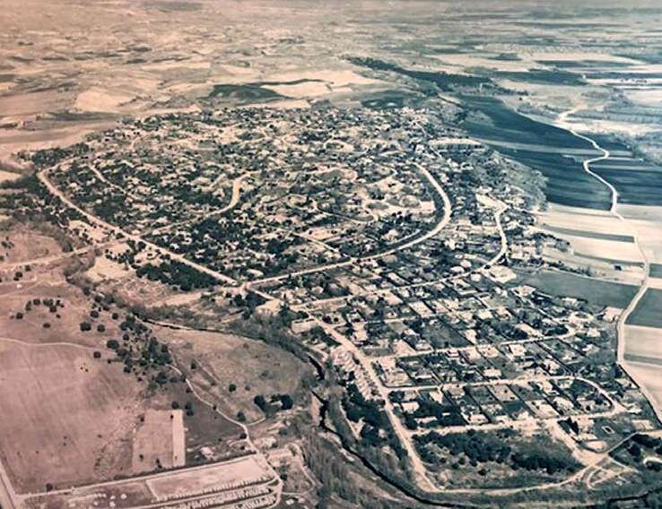

*** Datos Básicos

Ciudad Santo Domingo tiene una extensión de 752 hectáreas y 28 km de calles.
Es un núcleo de población exclusivamente residencial, con 950 parcelas
unifamiliares, 8 subcomunidades de pisos, un colegio público (CEIP) con
capacidad para 350 alumnos, una residencia con capacidad para 300 personas
mayores asistidas y 124 apartamentos para no asistidos, 2 centros comerciales,
parroquia, consultorio médico, etc. En total, más de 4.500 residentes
permanentes.

*** Constitución

La Comunidad de Propietarios se constituyó como sociedad civil el 22 de julio
de 1970 ante el notario de Madrid D. Enrique Giménez Arnau, aunque se rige por
la Ley de Propiedad Horizontal.

#+latex: \csdparte{I. Asuntos de la Comunidad de Propietarios}

** Gestión del agua

Junto con la seguridad, la gestión del agua es uno de los activos
fundamentales de Ciudad Santo Domingo. La Comunidad gestiona su propio ciclo
del agua. Extrae agua de *once pozos propios* al amparo de una concesión de la
Confederación Hidrográfica del Tajo de 2.071.611 m³ anuales, con las
extracciones monitorizadas en tiempo real. Las estaciones de bombeo se
alimentan en parte con energía de dos parques fotovoltaicos propios. El agua
se almacena en depósitos elevados y se distribuye por gravedad a la mayor
parte de la urbanización.

Las aguas residuales se recogen en una red de saneamiento propia y se tratan
en la *estación depuradora (EDAR)* de la Comunidad antes de su vertido al río
Guadalix. La calidad del vertido la controla un laboratorio externo.

De acuerdo con la normativa sanitaria, el agua de los pozos se destina a usos
distintos del consumo humano. Para el agua de boca, la urbanización dispone
de una *segunda red, independiente, abastecida por el Canal de Isabel II*.

#+INCLUDE: "./documentos.org::*Gestión del agua" :only-contents t :minlevel 3

** Nuestra seguridad

Ciudad Santo Domingo cuenta con un *servicio de seguridad privada permanente,
las 24 horas de todos los días del año*. El acceso se controla mediante
lectura automática de matrículas y grabación de vídeo de alta definición, y
vigilantes habilitados y armados patrullan el viario en vehículos eléctricos.

El dispositivo se completa con:

- Circuito cerrado de televisión (CCTV) con cámaras de visión nocturna en el
  perímetro exterior.
- Un centro de control que recibe las alertas y coordina la respuesta.

El director de seguridad y su equipo han recibido felicitaciones públicas de
la Guardia Civil y de la Policía Local, con las que trabajan en estrecha
coordinación. El equipo colabora además en emergencias sanitarias (infartos,
caídas), primeros auxilios, incendios y accidentes, situaciones en las que,
por su proximidad, se persona en pocos minutos.

#+INCLUDE: "./documentos.org::*Seguridad" :only-contents t :minlevel 3

** Estatutos de la Comunidad de Propietarios

*** Capítulo I. Denominación, objeto y domicilio

*Artículo 1.º* La Comunidad de Propietarios de Ciudad Santo Domingo está
integrada por los propietarios de parcelas y terrenos en la Urbanización
Residencial Ciudad Santo Domingo. Su domicilio se fija en la propia Ciudad
Santo Domingo, término municipal de Algete, de la provincia de Madrid.

*Artículo 2.º* Sus fines son:

- a) Atender a la utilización, conservación, reparación y mejora de servicios
  comunes de la Ciudad, sufragando sus gastos en forma estatutaria. Crear, en
  su caso, otros servicios nuevos.
- b) Cuidar del cumplimiento de las normas y ordenanzas aplicables a la
  Ciudad, manteniéndola dentro del carácter para el que fue concebida.
- c) Integrar a los propietarios para resolver sus problemas comunes
  representándoles ante el Estado, Provincia, Municipio o Entidades oficiales
  y personas físicas y jurídicas de toda índole, así como ante los Tribunales
  de Justicia.
- d) Armonizar las diferencias que surjan entre los distintos propietarios.

*Artículo 3.º* Se consideran servicios comunes de la Ciudad los siguientes:

1. Acceso, puente, viaducto, avenidas, calles, callejones, plazas, paseo,
   aceras y parques y jardines de dominio público.
2. Los desagües, cunetas, colectores, tuberías de saneamiento, registros,
   estación depuradora, etc., etc., que constituyen las instalaciones de
   saneamiento.
3. La instalación de alumbrado público constituida por la correspondiente red
   eléctrica y los postes con sus luminarias.
4. Señalización y balizamiento.
5. Limpieza general de todos los servicios comunes.
6. Consumo de energía eléctrica de los servicios comunes.
7. Consumo de agua en bocas de riego de los servicios comunes.
8. Servicios de guardería, vigilancia, organización y funcionamiento de los
   servicios comunes.
9. Obras de fábrica de los servicios comunes y su decoración.
10. Recogida y eliminación de basuras de la Ciudad.
11. Cualquier otro servicio que acuerde crear la Comunidad.

*Artículo 4.º* Quedarán en la titularidad patrimonial de la Promotora hasta
que ésta haga en su caso las adscripciones de titularidad que estime
adecuadas:

- a) La zona deportiva.
- b) Las zonas comerciales.
- c) Las zonas cultural y cultual.
- d) La zona rural.
- e) Todas las instalaciones de suministro de agua de la Ciudad. El conjunto
  de estas instalaciones lo forman diversos pozos, tuberías de elevación y
  distribución, depósitos, grupos elevadores, líneas eléctricas e
  instalaciones y obras de fábrica anejas.

*Artículo 5.º* El resto de las instalaciones eléctricas, comprendidas
subestaciones y centros de transformación con sus obras de fábrica, quedará en
la titularidad de Hidroeléctrica Española.

*Artículo 6.º* Se entiende por Ciudad Santo Domingo exclusivamente aquella
zona urbanizada que resulta delimitada en el plano unido a estos Estatutos
formando parte de los mismos. Si cualquier propietario de predio de Ciudad
Santo Domingo, situado en las lindes de la Ciudad, adquiriese por cualquier
título algún derecho sobre terrenos ajenos a la Ciudad no podrá utilizar la
posible colindancia de estos terrenos a su predio para extender a aquellos la
cualidad de zona perteneciente a la Ciudad. El cumplimiento de esta
prohibición faculta a la Comunidad para, además de ejercitar las acciones
legales pertinentes, privar al propietario de la utilización de los servicios
comunes de la Ciudad.

Esta Comunidad se constituye con plena personalidad jurídica como Sociedad
Civil.

*Artículo 7.º* Los derechos y obligaciones de los propietarios en la Comunidad
vendrán determinados por la superficie de los predios que posean en la Ciudad.
A estos efectos, a cada mil metros cuadrados o fracción de mil metros
cuadrados dentro de cada predio residencial se le asigna una cuota de
participación.

A los predios no residenciales se les asigna globalmente, según zonas que se
citan, las siguientes cuotas de participación:

- Zona deportiva: 20 cuotas.
- Zonas comerciales: 30 cuotas.
- Zona cultural y cultual: 10 cuotas.
- Zona rural: 10 cuotas.

quedando facultada la Promotora para distribuir estas cuotas en caso de
fraccionamiento de las correspondientes zonas, asignando a cada fracción
resultante la correspondiente cuota de participación en la Comunidad.

*Artículo 8.º* Los propietarios de terrenos tipo A para vivienda plurifamiliar
deberán necesariamente constituirse en Comunidad de Propietarios de acuerdo
con la Ley de Propiedad Horizontal de 21 de julio de 1960. El representante
legal de esta Comunidad de Propietarios será el único legitimado activa y
pasivamente para actuar ante la Comunidad de Propietarios de Ciudad Santo
Domingo.

*** Capítulo II. De los órganos de la Comunidad

*Artículo 9.º* Serán órganos de la Comunidad la Asamblea General, la Junta
Gestora y el Presidente, que lo será de ésta y de la Asamblea. El Presidente
será elegido por la Asamblea en el acto fundacional y su mandato será de dos
años, pudiendo ser reelegido por periodos iguales.

*Artículo 10.º* La Asamblea General de Propietarios estará integrada por la
totalidad de los que se mencionan en el artículo 1.º de los presentes
Estatutos.

La Asamblea General se reunirá cuando menos una vez al año dentro de su primer
trimestre, designando entre los componentes su Presidente y los propietarios
que integrarán la Junta Gestora.

Corresponderá a la Asamblea General las siguientes funciones:

- a) Aprobar el censo de propietarios incorporados a la Comunidad.
- b) Aprobar los presupuestos y los índices definitivos con arreglo a los
  cuales se realicen los repartos de cargas.
- c) Aprobar los planes anuales, conforme a los cuales hayan de realizarse las
  actividades previstas en el artículo 2.º de estos Estatutos.
- d) Sancionar las cuentas y justificantes presentados por la Junta Gestora,
  comprensivas de los pagos y cobros realizados.

*Artículo 11.º* Los acuerdos se adoptarán por mayoría de cuotas de
participación en la Comunidad y obligarán a todos los propietarios. Será
necesario, no obstante, el voto favorable de las dos terceras partes de las
cuotas totales de participación tomado en Asamblea General Extraordinaria
convocada al efecto para la disposición y enajenación de bienes y la
modificación de los Estatutos.

*Artículo 12.º* Cada propietario tendrá tantos votos como cuotas de
participación en la Comunidad posea.

La Asamblea General, en los asuntos que se sometan a su consideración y que,
naturalmente, se refieran al objeto y fines de la Comunidad, tendrá plena
soberanía en sus resoluciones, que serán obligatorias para todos los
propietarios, aun para los ausentes o disidentes.

*Artículo 13.º* La Asamblea General, tanto ordinaria como extraordinaria,
quedará válidamente constituida en primera convocatoria cuando concurran a
ella, presentes o representadas, la mayoría de las cuotas de participación en
la Comunidad y en su segunda convocatoria, cualquiera que sea el número de
cuotas concurrentes presentes o representadas. Entre la convocatoria y el día
señalado para la celebración de la Asamblea General en primera convocatoria
habrán de mediar al menos quince días. Haciéndose constar en el anuncio la
fecha en la que, si procediera, se reunirá la Asamblea General en segunda
convocatoria, sin que entre una y otra reunión pueda mediar un plazo inferior
a veinticuatro horas.

Los anuncios de convocatoria se harán mediante carta o circular dirigida a los
propietarios en el domicilio que figure en los archivos de la Comunidad.

*Artículo 14.º* La Junta Gestora estará integrada por el Presidente de la
Comunidad y seis propietarios, uno de los cuales actuará de Secretario de la
Junta y de la Asamblea General.

La Asamblea General podrá nombrar ---con independencia de los miembros de la
Junta Gestora--- un Vicepresidente ejecutivo, que asistirá a las Juntas con
voz y voto y ejercerá las funciones de Presidente en caso de enfermedad o
ausencia del titular. En cuanto a su nombramiento y a la vigencia de su cargo
regirán las mismas normas que las establecidas para el Presidente.

*Artículo 15.º* Los miembros de la Junta Gestora serán elegidos por la
Asamblea General ordinaria, y se renovarán por terceras partes cada año,
pudiendo ser reelegidos.

La Junta Gestora se reunirá como mínimo una vez al mes, haciendo el Presidente
la convocatoria a los componentes de la misma al menos con siete días de
anticipación.

Para que la Junta Gestora se reúna válidamente será necesaria la concurrencia
personal de al menos cuatro de sus miembros.

Los acuerdos adoptados por mayoría de miembros concurrentes serán válidos y el
voto del Presidente será de calidad, decidiendo en caso de empate.

Las decisiones de la Junta Gestora versarán sobre las normales operaciones
implicadas en la administración y conservación de los elementos e
instalaciones comunes, tales como contratación y supervisión del personal,
obras y servicios, abono de las cantidades adeudadas por estos conceptos y, en
general, sobre cualesquiera otras no atribuidas especialmente a la Asamblea
General.

Para la realización de las funciones materiales de administración podrá
contratarse los servicios de un Administrador y del personal auxiliar que se
estime necesario, e incluso podrá contratarse toda la labor de administración
con persona o empresa especializada.

*Artículo 16.º* Corresponderá especialmente a la Junta Gestora el reparto
entre los distintos propietarios de los costos producidos como consecuencia de
los acuerdos adoptados por la Asamblea y de su gestión administradora, de
conformidad con los índices establecidos y formando para ello listas
cobratorias, con arreglo a las cuales habrá de realizarse la recaudación.

La Junta Gestora, por medio de su Presidente o del miembro de la misma que
designe, ostentará la representación de la Comunidad, la defensa de sus
derechos y el ejercicio de sus acciones, pudiendo otorgar los poderes que
estime oportunos, incluidos poderes especiales o generales para pleitos.

*Artículo 17.º* Tanto los acuerdos de la Asamblea General como los de la Junta
Gestora serán reflejados en un libro de Actas, del que podrán expedirse
certificaciones a petición de cualquier propietario refrendadas por el
Secretario, con el visto bueno del Presidente.

*Artículo 18.º* Para la ejecución de los acuerdos de la Asamblea General y de
la Junta Gestora, y siempre que éstas no hayan nombrado representante
especial, el Presidente de la Comunidad, y en su caso quien le sustituya, será
su representante ante toda clase de personas y organismos en todo lo relativo
a la Comunidad, velará por los intereses de la Ciudad y actuará en nombre de
ésta ante los Órganos de la Administración Local, pudiendo proponer a las
Autoridades de este ámbito la imposición de sanciones por el incumplimiento de
las disposiciones vigentes en materia de policía administrativa. También podrá
comparecer ante Notario público, otorgando en nombre de la Comunidad poderes
generales para pleitos a favor de Procuradores de los Tribunales de cualquier
jurisdicción.

*** Capítulo III. De los miembros de la Comunidad

*Artículo 19.º* Serán miembros de la Comunidad los propietarios de predios
situados en Ciudad Santo Domingo, los que se considerarán incorporados a la
misma por el solo hecho de adquirir dicha calidad de propietarios.

La cualidad de miembro de la Comunidad se perderá automáticamente por la
enajenación, conocida o comunicada, de los predios con base a los cuales se
procedió a integrar en la Comunidad al propietario.

*Artículo 20.º* Los propietarios integrados en la Comunidad tendrán derecho a
participar, de la forma prevista en estos Estatutos, en los órganos de
administración de la Comunidad y a disfrutar de los servicios comunes de la
Ciudad y demás beneficios que a través de ella puedan obtenerse.

*Artículo 21.º* Los propietarios vendrán obligados a cumplir los acuerdos de
la Asamblea General y/o de la Junta relativos a la utilización y disfrute de
los servicios, instalaciones y elementos comunes, así como las decisiones que
sin violar lo establecido en disposiciones de carácter general adopte dicha
Asamblea y/o Junta para facilitar la convivencia dentro de la Ciudad.

*** Capítulo IV. Del régimen económico

*Artículo 22.º* Los propietarios vendrán especialmente obligados a aportar las
cantidades que les correspondan para el levantamiento de los gastos comunes.
Estos gastos se distribuirán una vez aprobado el presupuesto anual en
proporción a la cuota de participación en la Comunidad de cada propietario,
conforme a lo establecido en el artículo 7.º de estos Estatutos.

La aprobación del presupuesto anual compete especialmente a la Asamblea
General, la cual podrá asimismo alterar la cuantía de las aportaciones y
determinar las extraordinarias que procedan en virtud de casos y fines
concretos.

*Artículo 23.º* Si los propietarios no atendiesen voluntariamente al pago de
las aportaciones que les hubieran sido asignadas, según las cuotas de
participación que correspondan a sus predios, la Junta Gestora podrá optar
entre ceder al Ayuntamiento del término municipal los derechos que
correspondan a la Comunidad por tal concepto o hacerlos efectivos por conducto
de los órganos jurisdiccionales competentes; en el primer supuesto, la
Corporación Municipal tendrá plena libertad para aceptar la gestión de
cobranza en las condiciones que libremente estipule con la Comunidad. Todo
ello de acuerdo con lo establecido en el artículo 211 de la Ley del Suelo y
sin perjuicio de las demás acciones que en virtud de los presentes Estatutos
competen a la Comunidad.

*Artículo 24.º* El propietario que no atienda al pago de sus aportaciones
perderá automáticamente todo derecho a la utilización de los servicios comunes
de la Ciudad que se mencionan en el artículo 3.º de los presentes Estatutos y
cualquiera otros creados en beneficio de la Comunidad.

En su virtud la Comunidad queda facultada para actuar de hecho o de derecho de
la forma que estime conveniente a los efectos de privar al propietario moroso
de los citados servicios comunes.

También la Comunidad queda facultada para instar de la Promotora o de
Hidroeléctrica Española y en general de cualquier entidad o persona proveedora
de servicios o suministros, como pudieran ser los de agua, luz, etc., que
éstos le sean negados al propietario moroso.

*Artículo 25.º* La adquisición de alguna propiedad en la Urbanización CIUDAD
SANTO DOMINGO llevará consigo la integración del adquirente en la Comunidad y
su subrogación de los derechos y obligaciones de aquel de quien traiga causa.
Para conocimiento de los adquirentes, los miembros de la Comunidad quedan
obligados, en caso de transmisión, a que se hagan constar esa integración y
subrogación en los documentos en los cuales la transmisión se formalice.

*Artículo 26.º* Con objeto de dotar a la Comunidad de un capital inicial de
maniobra, cada propietario efectuará una aportación inicial de mil pesetas
(1.000 pesetas) por cada cuota de participación que se menciona en el
artículo 7.º de estos Estatutos y ascenderá en total a 2.431.000 pesetas.

Los presupuestos anuales por gastos de conservación y entretenimiento serán
fijados para cada ejercicio por la Asamblea General ordinaria.

Las aportaciones que deben entregar los propietarios de acuerdo con sus cuotas
de participación se recaudarán por trimestres naturales, debiendo ser pagadas
en la primera quincena de cada trimestre.

La morosidad o incumplimiento de la obligación de pago de las aportaciones,
además de las acciones que según los presentes Estatutos competen a la
Comunidad, producirá sin necesidad alguna de intimación la obligación de
abonar intereses de demora a razón del 12 por 100 anual a favor de la
Comunidad. Serán además de cargo del moroso todos los gastos y costes
judiciales que se pudieran producir.

*** Capítulo V. De las Ordenanzas de Ciudad Santo Domingo

*Artículo 27.º* Todos los planos y documentos del Plan Parcial de CIUDAD SANTO
DOMINGO forman parte de las presentes Ordenanzas.

Son vinculantes con total fuerza de obligar para los propietarios las normas y
disposiciones de los Órganos urbanísticos del Ayuntamiento de Algete, de la
Promotora y de la Comunidad de Propietarios.

*Artículo 28.º* Todos y cada uno de los terrenos y parcelas de la Ciudad son
recíprocamente predios dominantes y sirvientes de servidumbres de paso, de
conducciones de agua potable y residuales, redes de suministro de energía
eléctrica y en general cualquier servicio de la Urbanización y de sus
accesorios para su instalación, conservación, reparación y mejora y de paso
del personal que esté al cuidado de dichos servicios o deba realizar las
correspondientes obras.

*Artículo 29.º* Cada uno de los terrenos o parcelas de la Ciudad es predio
dominante de una servidumbre continua en orden al uso y utilización de los
servicios y elementos comunes de la Ciudad que se mencionan en el artículo 3.º
de los presentes Estatutos. Los gastos de utilización, conservación,
reparación y mejora de dichos servicios y elementos comunes serán de cuenta
del titular del predio dominante de acuerdo con la cuota de participación en
los gastos comunes que se establecen en el artículo 7.º de estos Estatutos.

*Artículo 30.º* Los propietarios quedan obligados:

- a) A respetar las instalaciones y obras generales o en provecho de otro
  propietario, que interfieran, atraviesen, sobrevuelen su predio o de
  cualquier otra forma le afecte.
- b) A consentir la ejecución en su predio de las obras que a juicio de la
  Comunidad sean convenientes para la utilización, conservación, reparación o
  mejora de los servicios e instalaciones de la Ciudad.
- c) A permitir la entrada en su predio a los efectos previstos en los
  apartados anteriores.
- d) A no dedicar el predio a otros usos que el de vivienda, con autorización
  de ejercicio de la profesión del titular propietario. Lo establecido en este
  apartado no tendrá aplicación a los predios correspondientes a zonas de
  afección especial según el Plan Parcial (deportiva, comercial, cultural,
  etc.).
- e) A observar la diligencia debida en el uso del predio y en sus relaciones
  con los demás titulares de la Ciudad y a responder ante la Comunidad de
  Propietarios de las infracciones ocasionadas por quien ocupe su predio, sin
  perjuicio de las acciones directas que procedan.
- f) A sufragar las aportaciones que fije la Comunidad.

*Artículo 31.º* Para ejecutar cualquier obra dentro de la Ciudad se precisa un
permiso que, después de merecer el visto bueno de la Dirección Técnica de
Control del Plan Parcial, nombrada por la Promotora para vigilancia del
cumplimiento del Plan Parcial, se solicitará en su caso por intermedio de ésta
del Ayuntamiento de Algete.

Todos los proyectos de edificios o reforma constarán de memoria, planos,
presupuesto, mediciones y pliego de condiciones, debiendo estar visados por el
Colegio de Arquitectos e indicándose en la memoria los materiales a emplear,
su calidad y su colocación.

*Artículo 32.º* Serán objeto de permiso de obra:

1. Todas las nuevas construcciones sobre tierra y subterráneas, incluidas las
   excavaciones para caja de cimientos, etc. También se considera como
   construcción los cercados de deslinde a las calles y a los vecinos, pozos
   muertos, instalaciones de clarificación, tuberías de agua y desagüe,
   depósitos, barandillas, pérgolas, toldos, astas, grupos electrógenos, etc.
   Todos los andamios y cercados de obra.
2. En edificios ya existentes la construcción o el cambio de elementos
   cargados (paredes, pilares, techos, construcciones de hierro), de elementos
   o cuerpos construidos que sobresalgan de los muros exteriores, aperturas de
   ventanas, puertas, escaleras, y de pozos para luz o ventilación y
   elevadores, de hogares, chimeneas, hogares de gas y demás modificaciones y
   cambios en comunicación de la construcción, líneas de alta tensión, montaje
   de motores, la modificación de pozos vaciadores, retretes o también la
   modificación y el cambio de cercados de terraza y de los linderos, la
   reconstrucción o el cambio del estado anterior de una obra destruida por
   incendio o por otra causa.
3. En edificios que sirvan para comercio, cada cambio de la disposición
   arquitectónica anterior.

*Artículo 33.º* Se entiende por volumen legal de edificación el volumen
teórico de los paralelepípedos cuyas bases son las superficies construidas en
cada planta, limitadas por las caras exteriores de los cerramientos y cuya
altura es la mínima libre permitida entre forjado y forjado.

En esta cubicación se excluyen las construcciones por debajo del forjado de la
primera planta, los voladizos sin cerramiento de fábrica, al igual que los
sótanos y las terrazas.

A efectos de cubicación se consideran, pues, las alturas como las mínimas
permitidas (3 metros libres en la planta comercial y 2,50 metros en la planta
de vivienda).

La superficie legal se corresponde con los volúmenes dimensionados con los
anteriores criterios.

En los edificios complementarios de interés público que tengan una
justificación excepcional se podrá proponer un aumento en el volumen prefijado
de hasta un 20 por 100.

*Artículo 34.º* En la superficie edificable se distingue la fundamental y la
secundaria.

La superficie fundamental está constituida por la vivienda en sí y el despacho
profesional.

La superficie secundaria por el garaje y las instalaciones accesorias
deportivas y ocupará como máximo un 20 por 100 de la fundamental teórica.

Ambas superficies se consideran en el desarrollo total del área construida
(eliminadas las terrazas y patios habitables y las superficies de sótano no
habitables).

Parcelas unifamiliares aisladas.

La superficie edificable será un 15 por 100 para los primeros 2.000 metros
cuadrados de parcela y un 10 por 100 para los restantes metros a partir de los
2.000.

Parcelas plurifamiliares o aisladas en cadena.

Se distinguen dos tipos de edificabilidad:

- Tipo 1 - 0,20 m² de construcción por m² de parcela.
- Tipo 2 - 0,30 m² de construcción por m² de parcela.

*Artículo 35.º* Queda prohibido:

- a) La decoración exterior de los edificios mediante elementos estilísticos
  inadecuados.
- b) Los materiales de revestimiento deleznables, así como los colores
  detonantes.
- c) Los elementos por encima de la última planta permitidos en esta Ordenanza
  (depósitos de agua, cajas de escalera, etc.) se harán con los mismos
  materiales de la fachada, cuidando de que su composición arquitectónica se
  incorpore a la del resto del edificio.

*Artículo 36.º* Se considerarán aceptables todas las buenas técnicas de la
construcción actual.

Los materiales de construcción pueden ser todos los idóneos de la técnica
actual, pero su presentación exterior en fachadas será especialmente cuidada,
rechazándose los materiales de rápido envejecimiento y todos los deleznables
cuyo desprendimiento estropee el aspecto plástico de la fachada y suponga un
riesgo para los peatones.

*Artículo 37.º* Las cercas de las lindes que den frente a las calles deberán
hacerse obligatoriamente según el modelo que facilite la Dirección Técnica de
Control del Plan Parcial.

Las cercas entre parcelas en sus últimos cinco metros a partir de la fachada
de calle también deberán realizarse según el mismo diseño.

Las cercas entre parcelas a partir de los cinco metros deberán hacerse
libremente de común acuerdo ambos colindantes, con la única condición de que
su altura maciza no sobrepase los dos metros.

*Artículo 38.º* En la Ciudad se distinguirán cuatro tipos de parcelas
residenciales:

Tipo «A». Parcelas comunes para viviendas plurifamiliares o unifamiliares en
cadena. En el Plan Parcial sólo figura la disposición de la zona, debiendo
reparcelarse en el momento de proyectar los bloques de edificios.

Dentro de las viviendas unifamiliares aisladas se distingue:

- Tipo «B».---Estas parcelas tienen una superficie que oscila entre los 1.000
  y 2.000 m².
- Tipo «C».---Cuya superficie oscila entre los 2.000 y los 4.000 m².
- Tipo «D».---Cuya superficie es superior a los 4.000 m².

Retranqueo mínimo a frente de calle:

- Parcela tipo «A» (comunales), el retranqueo mínimo será de 7 m.
- Parcela tipo «B» (de 1.000 a 2.000 m²), 7 m.
- Parcelas «C» y «D» (de 2.000 m² en adelante), 10 m.

Retranqueos a laterales y fondos:

Para altura de edificación: hasta 3,50 m.

- Parcela tipo «A»: 5 m.
- Parcela tipo «B»: 5 m.
- Parcelas «C» y «D»: 6 m.

Por cada 0,50 por encima de los 3,50 m. se aumentará la separación de los
linderos a 1 m.

Las unidades reunidas por escalera o entrada comunes podrán ir adosadas por
las medianerías, formando composiciones en cadena. Cada uno de estos conjuntos
constituirá un bloque cuyos retranqueos laterales y fondos serán equivalentes
a los de las viviendas de tipo B.

Las parcelaciones que figuran en el plano correspondiente del Plan Parcial en
el momento en que quedan replanteados sobre el terreno y registrados serán
invariables.

*Artículo 39.º* Se prohíben las instalaciones de fosas sépticas o vertidos
directos al terreno, admitiéndose como único vertido de las aguas residuales
de las parcelas el empalme a la red general de alcantarillado.

Se prohíbe el utilizar los terrenos de la Ciudad para vertido de basuras,
debiéndose evacuar éstas en su totalidad mediante el servicio de recogida que
se ocupará de su incineración.

De ninguna manera se podrán hacer viviendas aisladas o agrupadas sin que
tengan, al menos, una habitación con dos horas de asoleo el 21 de diciembre.

*Artículo 40.º* Se prohíbe construir con carácter permanente almacenes o
depósitos de materiales; éstos tendrán de duración el tiempo en que se
realicen las obras en el predio.

*Artículo 41.º* Queda prohibido el aparcamiento de automóviles de forma
permanente en las calles de la Ciudad.

*Artículo 42.º* Las piscinas irán necesariamente dotadas de instalación
completa de depuración.

*** Capítulo VI. Disolución y liquidación de la Comunidad

*Artículo 43.º* Ningún propietario podrá separarse de la Comunidad si no es
desprendiéndose a la vez de la titularidad del predio del que es propietario.

Tampoco el propietario podrá accionar la división de la cosa común dado que
por su propia naturaleza el condominio que por la presente Comunidad se
reglamenta es indivisible e inseparable de la propiedad individualizada sobre
el correspondiente predio.

En su virtud la disolución de la Comunidad sólo podrá efectuarse por acuerdo
unánime de todos los miembros, adoptado en Asamblea General extraordinaria
convocada al efecto, la que entonces dictará las normas precisas para llevar a
cabo la disolución.

*** Capítulo VII. Disposiciones finales

*Artículo 44.º* Si algunos propietarios de Ciudad Santo Domingo acordasen
constituirse en cualquier tipo de Asociación con personalidad jurídica, al
amparo de la Ley de Asociaciones, Ley del Suelo u otro Cuerpo legal, con fines
análogos a los perseguidos por la Comunidad, ésta podrá acordar con dicha
Asociación su forma de actuación conjunta.

*Artículo 45.º* Los fines que atiende la Comunidad benefician sin excepción a
todos los propietarios de predios en Ciudad Santo Domingo. Por ello la
obligación de contribuir al pago de las cargas vincula a todos los citados
propietarios, sin que sea válido para intentar eximirse de esta obligación el
alegar desinterés en la Comunidad, puesto que la calidad de miembro de la
Comunidad es inseparable por propia naturaleza de la propiedad del predio, o
la no utilización de servicios e instalaciones comunes cuya conservación,
reparación y mejora corresponde según su cuota de participación al propietario
del predio, cuyo valor económico depende precisamente del buen estado de
dichos servicios e instalaciones y no del grado de utilización que de los
mismos haga el propietario.

*Artículo 46.º* Para todos los asuntos relativos a la Comunidad, los
propietarios renuncian a su fuero propio y se someten expresamente a la
jurisdicción de los Juzgados y Tribunales de Madrid.

#+begin_flushright
*Los presentes Estatutos figuran insertos en el protocolo del Notario de*\\
*Madrid don Enrique Giménez Arnau y Gran, bajo el número 4.391,*\\
*según escritura de 22 de julio de 1970*
#+end_flushright

** Junta Gestora y Gerencia

*** Junta Gestora (artículos 9 y siguientes de los Estatutos)

*Art. 9.* Serán órganos de la Comunidad la Asamblea General, la Junta Gestora
y el presidente, que lo será de ésta y de la Asamblea. El presidente será
elegido por la Asamblea en el acto fundacional y su mandato será de dos años,
pudiendo ser reelegido por periodos iguales.

*Art. 14.* La Junta Gestora estará integrada por el presidente de la Comunidad
y seis propietarios, uno de los cuales actuará de Secretario de la Junta y de
la Asamblea General.

La Asamblea General podrá nombrar ---con independencia de los miembros de la
Junta Gestora--- un Vicepresidente ejecutivo, que asistirá a las Juntas con
voz y voto y ejercerá las funciones de presidente en caso de enfermedad o
ausencia del titular. En cuanto a su nombramiento y a la vigencia de su cargo
regirán las mismas normas que las establecidas para el presidente.

*Art. 15.* Los miembros de la Junta Gestora serán elegidos por la Asamblea
General ordinaria, y se renovarán por terceras partes cada año, pudiendo ser
reelegidos.

La Junta Gestora se reunirá como mínimo una vez al mes, haciendo el presidente
la convocatoria a los componentes de la misma al menos con siete días de
anticipación.

Para que la Junta Gestora se reúna válidamente será necesaria la concurrencia
personal de al menos cuatro de sus miembros.

Los acuerdos adoptados por mayoría de miembros concurrentes serán válidos y el
voto del presidente será de calidad, decidiendo en caso de empate.

Las decisiones de la Junta Gestora versarán sobre las normales operaciones
implicadas en la administración y conservación de los elementos e
instalaciones comunes, tales como contratación y supervisión del personal,
obras y servicios, abono de las cantidades adeudadas por estos conceptos y, en
general, sobre cualesquiera otras no atribuidas especialmente a la Asamblea
General.

Para la realización de las funciones materiales de administración podrá
contratarse los servicios de un Administrador y del personal auxiliar que se
estime necesario, e incluso podrá contratarse toda la labor de administración
con persona o empresa especializada.

*** Gerencia

La Junta Gestora está facultada para contratar los servicios de una Gerencia
con las siguientes funciones:

- Organización, coordinación y seguimiento de las distintas áreas de la
  Comunidad de Ciudad Santo Domingo:
  - Administración
  - Seguridad
  - Saneamiento y Agua
  - Depuración
- Control y gestión de la Contabilidad, elaboración y presentación de los
  estados contables.
- Impuestos y Tributos.
- Presupuestos y Tesorería: Elaboración y seguimiento de los presupuestos
  trimestrales y anuales, comparativa y costes.
- Bancos y Caja: Establecimiento y mantenimiento de los distintos servicios,
  domiciliaciones, gestión de cobro, pago de pensiones, etc.
- Recursos Humanos: Control y supervisión de todas las áreas y tareas
  relacionadas con nóminas, gestión de personal, seguros sociales y relaciones
  con empresas de gestión.
- Seguros en general.
- Proveedores: Supervisión y gestión de los mismos.
- Auditoría: Preparación y elaboración de la auditoría anual junto con los
  auditores, así como el estudio de las recomendaciones.
- Relaciones internas y externas, con Comuneros, Bancos/Cajas, Seguros,
  Proveedores, etc.
- Representar a la Comunidad ante la Administración y Tribunales de Justicia.

** Reglamento de la Asamblea General de la Comunidad de Propietarios

Sin perjuicio de la regulación de la misma que se contiene en los artículos 10
a 13 de los Estatutos de la Comunidad, y lo dispuesto en la Ley de Propiedad
Horizontal, se acuerdan este Reglamento a fin de dar respuesta reglada a
aquéllas otras cuestiones que en la práctica pueden provocar problemas en la
celebración de la Junta.

*** Artículo 1. La Asamblea General

La Asamblea General estará integrada por la totalidad de los propietarios de
parcelas y terrenos en la Urbanización Residencial Ciudad Santo Domingo.

Se reunirá al menos una vez al año con carácter ordinario, y será convocada
dentro del primer trimestre del ejercicio, si bien supeditada a tener
finalizada la auditoría de los estados financieros del ejercicio anterior, y
tendrá como facultades:

- a) La elección entre los comuneros del Presidente de la Comunidad de
  Propietarios y de los miembros de la Junta Gestora.
- b) La aprobación de las cuentas anuales del ejercicio anterior
- c) La aprobación del presupuesto para el siguiente ejercicio
- d) La aprobación del censo de propietarios miembros de la Comunidad
- e) La aprobación de los planes anuales para atender a los fines de la
  Comunidad.

Además podrá reunirse con carácter extraordinario siempre que el Presidente de
la Comunidad de Propietarios lo considere necesario. También podrá reunirse
cuando sea solicitado así por al menos el 25% de los propietarios, o un número
de éstos que representen al menos el 25% de las cuotas de participación. En
este caso, deberán previamente requerir al Presidente la convocatoria, y sólo
en el caso de que éste no atienda su petición, podrán proceder a la
convocatoria por su cuenta.

Cualquier comunero podrá solicitar del Presidente la inclusión en el Orden del
día de los asuntos que considere de interés general. No obstante, será a
criterio del Presidente su inclusión o no, sin perjuicio de que el asunto se
suscite en el punto de ruegos y preguntas. Esta solicitud deberá hacerse antes
de la convocatoria a Junta.

*** Artículo 2. Convocatoria

La convocatoria a la Asamblea deberá hacerse al menos con quince días
naturales de antelación, debiendo señalarse el orden del día, la fecha de la
primera y segunda convocatoria, y el lugar de la reunión. Además se incluirá
en la convocatoria el listado de comuneros morosos en ese momento, con la
cantidad debida, y que estarán privados de voto.

Las comunicaciones con la convocatoria se harán mediante carta dirigida al
domicilio de cada comunero que figure en los archivos de la Comunidad, y en su
defecto, a la parcela de la que sea propietario.

Sin perjuicio de lo anterior, la convocatoria se publicará en el tablón de
anuncios de la Comunidad y en la página web de la misma.

*** Artículo 3. Documentación y derecho de información

Con la convocatoria a la Asamblea se adjuntará la documentación que por la
Junta Gestora se considere necesaria para la información de los comuneros.

Además, cualquier comunero interesado podrá consultar la documentación
contable, o cualquier otra propia de la Comunidad, en las oficinas de la
misma, dentro de su horario habitual y hasta el día anterior a la celebración
de la Asamblea incluido. Se permitirá que saque fotocopias pero a su costa. No
obstante, se podrán restringir las copias a aquéllos documentos que por la
normativa de protección de datos, así se considere por la Junta Gestora.

*** Artículo 4. Asistencia y representación

La asistencia a la Asamblea General será individual por cada parcela, de
manera que en caso de haber varios copropietarios de una parcela, deberán
ponerse de acuerdo entre ellos sobre quién asistirá en su nombre a la
Asamblea.

Sólo se admitirá en la Junta la intervención y voto de un solo copropietario o
representante por parcela, no obstante, se permitirá la asistencia como
oyentes de aquéllos otros interesados (otros copropietarios, abogados,
técnicos, etc).

Podrá otorgarse la representación a un tercero, sea o no comunero, para la
asistencia a la Asamblea, delegando en él el derecho a intervenir y al voto.
Para acreditar dicha representación servirá un poder notarial al respecto,
incluso con carácter general para todas las Asambleas, o un simple escrito que
sólo se referirá a la Asamblea en cuestión, firmado por el representado, que
deberá acreditarlo fehacientemente.

En caso de que algún comunero comparezca acompañado de un notario para que
levante acta de la Asamblea, o pretenda grabar la misma, deberá plantearlo al
inicio de la misma, siendo sometida a la votación de los presentes si se
autoriza o no.

*** Artículo 5. Constitución de la Asamblea

La Asamblea General quedará válidamente constituida en primera convocatoria
cuando concurran a ella, presentes o representadas, la mayoría de las cuotas
de participación de la Comunidad; y en segunda convocatoria, cualquiera que
sea el número de cuotas concurrentes.

*** Artículo 6. Mesa de la Asamblea. Presidencia y dirección de debates

La Asamblea General estará presidida por el Presidente de la Comunidad de
Propietarios y en su caso por el Vicepresidente, en caso de enfermedad o
ausencia del titular.

En los casos en que no haya Presidente ni Vicepresidente, por la razón que
fuese, la Asamblea será presidida por el comunero asistente de mayor edad.

El Presidente de la Asamblea dirigirá el transcurrir de la misma,
introduciendo los puntos del orden del día y concediendo la palabra a los
comuneros que quieran intervenir. Igualmente dispondrá el fin de las
intervenciones, ordenando la votación correspondiente a cada punto del orden
del día.

Junto con el Presidente, la mesa de la Asamblea estará compuesta por el
Secretario de la Comunidad de Propietarios. En caso de ausencia de éste, será
sustituido por cualquier miembro de la Junta Gestora, y en su defecto, por el
comunero asistente de menor edad.

*** Artículo 7. Desarrollo de la Asamblea

Antes del inicio de la misma, se elaborará una lista de asistentes, expresando
en la misma los siguientes datos: nombre y apellidos del comunero, parcela, y
en su caso nombre y apellido del representante.

Dicha lista deberá actualizarse a lo largo de la Asamblea, indicándose los
comuneros que concurran más tarde de su inicio, o la salida de los que no se
queden hasta el final, expresándose el momento en que entraron o salieron.

Los turnos de palabra los concederá el Presidente de la Asamblea según su
criterio, permitiendo en todo caso que tomen la palabra al menos tres
comuneros por cada sentido del voto de la cuestión tratada.

Los intervinientes deberán guardar el respeto a los demás asistentes, tanto en
sus palabras como en sus formas, pudiendo el Presidente retirar la palabra a
quien incumpla estas normas básicas de convivencia.

En cualquier caso, el Presidente podrá retirar la palabra a quien se exceda en
el tiempo de su intervención. Previamente deberá en cada caso señalar qué
tiempo concede para ello, a fin de evitar discrepancias al respecto.

También podrá retirar la palabra a quien no se ajuste al punto del orden del
día debatido, sin perjuicio de que pueda reiterarse lo que se desee en el
punto final de ruegos y preguntas.

Excepcionalmente, el Presidente podrá conceder el turno de palabra a quien no
sea comunero ni intervenga como representante, como puede ser a técnicos o
abogados que expongan el parecer de la Junta Gestora o de un comunero.

*** Artículo 8. Votaciones

Están privados de voto los comuneros en situación de morosidad al comienzo de
la Asamblea. Previamente, en la convocatoria se habrá indicado qué comuneros
deben cantidades a la Comunidad y en qué cuantía, pudiendo acreditar el pago
al inicio de la Asamblea a fin de que se les reconozca el derecho al voto. No
obstante, se les reconoce el derecho a intervenir en los debates.

El voto deberá ser público, expresando de forma oral si se aprueba o no el
acuerdo, o en su caso se abstiene, e indicando su nombre y parcela de la que
es propietario o a la que representa. Excepcionalmente el Presidente y de
acuerdo con la opinión mayoritaria de los presentes y representados, podrá
optar por que el voto sea secreto mediante papeletas y urna.

*** Artículo 9. Adopción de acuerdos

Cada comunero tendrá tantos votos como cuotas de participación.

Los acuerdos se adoptarán por mayoría de cuotas de participación de los
asistentes a la Asamblea, y obligarán a todos los comuneros. Será necesario,
no obstante, el voto favorable de las dos terceras partes de las cuotas
totales para acordar: la disposición y enajenación de bienes de la Comunidad.

Será necesaria la unanimidad para acordar la disolución de la Comunidad, así
como modificación de estatutos.

*** Artículo 10. Finalización de la Asamblea

Una vez proclamado el resultado de las votaciones, y del punto sobre ruegos y
preguntas, el Presidente podrá dar por finalizada la Asamblea, levantando la
sesión.

Por razones excepcionales, antes de su finalización el Presidente podrá
acordar la suspensión temporal de la Asamblea, que deberá volver a
constituirse tan pronto como cese la causa de la suspensión.

*** Artículo 11. Acta de la Asamblea

El Secretario de la Asamblea levantará acta de la misma, que deberá recoger al
menos los siguientes datos:

- a) La fecha y lugar de celebración.
- b) El autor de la convocatoria, y en su caso, los propietarios que la
  hubieren promovido.
- c) Su carácter ordinario o extraordinario, y si se celebró en primera o
  segunda convocatoria.
- d) Relación de los asistentes y sus respectivos cargos, así como de los
  propietarios representados, con indicación en todo caso de sus cuotas de
  participación.
- e) El orden del día de la reunión.
- f) Los acuerdos adoptados, indicando el resultado de las votaciones, con
  relación de los votos favorables, en contra, y abstenciones, mencionando el
  voto de cada comunero.

El acta deberá cerrarse con las firmas del Presidente y del Secretario al
terminar la reunión o dentro de los treinta días naturales siguientes. Desde
su cierre los acuerdos adoptados serán ejecutivos.

El acta se comunicará a los comuneros de la misma forma que la convocatoria a
la Asamblea, publicándose siempre en la web de la Comunidad de Propietarios.

Serán subsanables los defectos o errores del acta, antes de la siguiente
reunión de la Asamblea, que deberá ratificar la subsanación y el texto
definitivo del acta anterior.

Los acuerdos adoptados se reflejarán en un libro de actas diligenciado por el
Registrador de la Propiedad. El Secretario custodiará los libros de actas, y
deberá conservar durante el plazo de cinco años las convocatorias,
comunicaciones, apoderamientos y demás documentos relevantes de las reuniones.

*** Artículo 12. Interpretación y modificación de este Reglamento

La interpretación de este Reglamento corresponde a la Junta Gestora, quien
asimismo podrá proponer a la Asamblea General modificaciones al mismo cuando
lo considere necesario.

*** Artículo 13. Aprobación y vigencia

Este Reglamento será de aplicación una vez que resulte aprobado por la
Asamblea general, bastando para ello la mayoría simple de las cuotas de
participación de los asistentes.

#+latex: \csdparte{II. Asuntos municipales}

** Asuntos municipales
:PROPERTIES:
:PORTADILLA: no
:END:

Ciudad Santo Domingo pertenece al municipio de Algete (21.000 habitantes).
Sus calles son públicas, por lo que el Ayuntamiento presta los servicios
urbanos habituales: alumbrado, pavimentos, limpieza viaria, recogida de
basuras, Policía Local y punto limpio, y aplica la normativa de convivencia y
urbanismo. La Comunidad de Propietarios gestiona por su cuenta el suministro
de agua y la seguridad privada. La web del Ayuntamiento es
[[https://aytoalgete.es/][aytoalgete.es]].

*Línea Verde* es la aplicación del Ayuntamiento para comunicar incidencias en
la vía pública (desperfectos, mobiliario urbano, alumbrado, etc.). La
incidencia se envía geolocalizada, lo que agiliza su resolución:
[[http://www.lineaverdealgete.com/][Acceso a Línea Verde Algete]].

** Tenencia de Alcaldía
:PROPERTIES:
:PORTADILLA: no
:END:

La oficina del Ayuntamiento en la urbanización atiende de lunes a viernes, de
10:00 a 14:00 h, para trámites municipales: padrón, licencias de obra,
permisos de tala, impuestos y registro de escritos.

*Teléfono: 916 220 406*\\
*Correo: [[mailto:mmontouto@aytoalgete.com][mmontouto@aytoalgete.com]]*\\
[[https://aytoalgete.es/index.php?option=com_content&view=article&id=175&Itemid=628][Tenencia de Alcaldía en aytoalgete.es]]

#+attr_latex: :width .8\linewidth
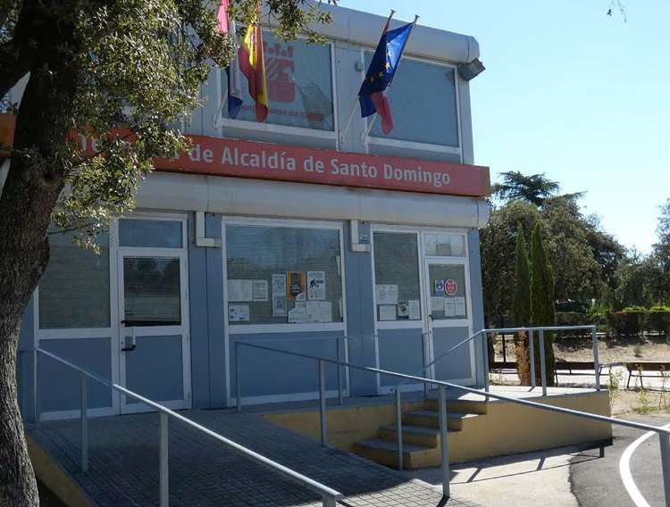

** Policía de urbanizaciones
:PROPERTIES:
:PORTADILLA: no
:END:

Esta unidad de la Policía Local de Algete, creada en febrero de 2022, está
formada por dos agentes con un vehículo radiopatrulla y atiende
específicamente a Ciudad Santo Domingo y Prado Norte.

*Teléfono móvil directo: 659 625 379*\\
*Horario: de lunes a viernes, de 8:00 a 14:00 h.*\\
[[https://aytoalgete.es/index.php?option=com_content&view=article&id=200&Itemid=666][Información oficial de la Policía Local de urbanizaciones]]

#+attr_latex: :width .8\linewidth
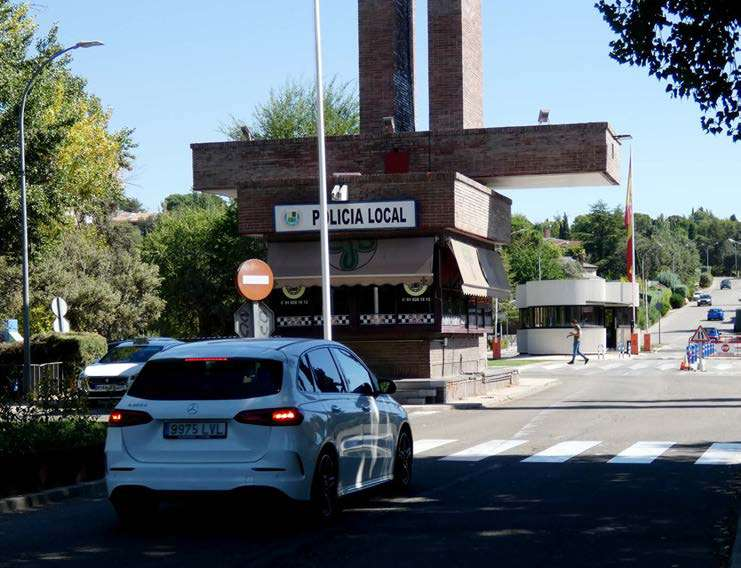

*** Policía Comunitaria de Prado Norte y Santo Domingo

La Unidad de Policía Comunitaria de la Policía Local de Algete se creó en
febrero de 2022. Esta nueva unidad policial está integrada por dos agentes
que, dotados de un vehículo, patrullan en el ámbito geográfico de la
Urbanización Santo Domingo y de Prado Norte. Esta unidad cuenta con un
teléfono móvil propio con el que pueden comunicar los vecinos: 659 625 379.

El modelo de Policía Comunitaria es un cambio en el paradigma del modelo
policial, pasando del clásico esquema reactivo en el que el policía
permanecía ajeno al entorno social para intervenir únicamente cuando se
detectaba una infracción, a un modelo eminentemente proactivo donde el
policía es conocedor específico de los problemas sociales que están teniendo
lugar a su alrededor. Pasa a formar parte del paisaje de cada comunidad,
involucrándose con los interesados en la búsqueda de soluciones a los
problemas de convivencia que les afectan.

Hoy en día la seguridad exige un tratamiento muy diferente: desde políticas
represivas a nivel nacional e internacional para enfrentarse a los fenómenos
relacionados con el crimen organizado (terrorismo, tráfico de seres humanos,
drogas ilegales, etc.) hasta la atención de las demandas ciudadanas a nivel
vecinal o familiar, lo cual precisa de actuaciones de cariz más asistencial
que policial en el sentido clásico del término. En este contexto podemos
observar cómo las distintas instituciones policiales van prodigando
esfuerzos para superar las barreras cognitivas que les separan del
ciudadano.

Existen muchas campañas de publicidad institucional con consejos sobre
seguridad doméstica y creación de unidades policiales específicamente
dedicadas a la interacción con los colectivos más vulnerables, campañas de
prevención ante diversas situaciones, etc., y todo ello es digno de alabanza,
pero para llegar a ser un referente comunitario no es suficiente, se
requiere algo mucho más profundo: redefinir el rol de la policía y ahondar en
la perspectiva de la comunicación real con el ciudadano. He aquí donde entra
en escena el modelo de Policía Comunitaria que se va a instaurar en las dos
urbanizaciones alejadas del casco urbano de Algete.

La filosofía del modelo policial de Policía Comunitaria se basa en principios
básicos de actuación como son: Descentralización del mando y autonomía de
gestión; Proximidad a la comunidad; Impulso de participación ciudadana en la
seguridad; corresponsabilidad del ciudadano con los problemas existentes;
resolución de problemas, prevención y proactividad, identificación con el
territorio; multidisciplinariedad de servicios, integración social y
reconocimiento de capacidades o perfiles adecuados del policía para
desempeñar las funciones. Con esta filosofía, la figura del Policía
Comunitario incorpora un importante incremento en la percepción de seguridad
y de la calidad de vida de la población, así como la cohesión y solidaridad
social. Uno de los fundamentos principales que define esta nueva Unidad es el
conocimiento y cercanía que la población tenga de los agentes, lo que se
consigue con la invarianza de los propios agentes de la Unidad.

Las funciones GENERALES de la policía de proximidad son las encomendadas en
la legislación policial destacando otras, como: promover y establecer una
relación más cercana entre la ciudadanía y la Policía Local; aumentar la
confianza mediante la intervención de la Policía Local orientada al
conocimiento del entorno y prevención de sus posibles riesgos que permita
atender las demandas de los habitantes, logrando a su vez la participación
de la Comunidad; y mejora de la percepción de seguridad en las
urbanizaciones.

Entre las funciones ESPECÍFICAS de esta patrulla destacan: Realización de la
entrada y salida de los menores en los centros escolares, de cara a
colaborar en la prevención y lucha contra el absentismo escolar, prevención y
lucha con el consumo/tráfico de sustancias ilegales y garantizar una
convivencia pacífica del alumnado; control de los vertidos vegetales, o de
otra naturaleza; Intervención en el centro escolar a demanda de la Unidad
Agente Tutor; comprobación de requisitos y autorización en los rodajes en la
vía pública, así como del estacionamiento de sus vehículos; control y
retirada de los vehículos en estado de abandono; reuniones periódicas con
las autoridades municipales de las urbanizaciones para el buen
funcionamiento de los servicios policiales; control y supervisión del
perfecto estado de la señalización vial, farolas, marquesinas de autobús,
etc.; realización de campañas de la DGT como «control de velocidad»,
«distracciones al volante, aparcamiento correcto...»; colaboración habitual
con la Unidad Canina; aumento de los niveles de seguridad y confianza en los
servicios policiales en el entorno comercial; mantener un contacto diario y
próximo con la ciudadanía en el mismo espacio geográfico favoreciendo la
relación con la población; elaborar planes de prevención en materia de
seguridad ciudadana, Intervención en casos detectados de maltrato animal;
asistencia y «colaboración temprana» con la Seguridad Privada; actuación
reguladora en caso de inclemencias atmosféricas o siniestros; apoyo al
arquitecto municipal en la vigilancia de obras; vigilancia específica de los
parques públicos y su uso ilícito; vigilancia y actuación policial en el caso
de sorprender a infractores realizando pintadas o acciones vandálicas.

#+INCLUDE: "./documentos.org::*Procedimiento de recogida de podas" :minlevel 2

** Recogida de basuras
:PROPERTIES:
:PORTADILLA: no
:END:

La ordenanza municipal de residuos regula la recogida de la basura doméstica
y el depósito de restos vegetales en la vía pública:
[[http://www.aytoalgete.es/images/reglamentos_ordenanzas/Modificacion_Ordenanza_Residuos.pdf][Ordenanza municipal de residuos (PDF, Ayuntamiento de Algete)]].

# El anexo 4 de la ordenanza de residuos (depósito y recogida de restos
# vegetales) se reproducía aquí íntegro. Retirado en la revisión de estilo de
# septiembre de 2026: el dosier de podas explica el procedimiento y se enlaza
# la ordenanza completa. Se conserva comentado por si la Junta decide
# recuperarlo.
#
# *** Anexo 4. Depósito y recogida de residuos vegetales en espacios públicos
#
# **** 1. Objeto
#
# El presente anexo tiene por objeto establecer las condiciones que han de
# regir el depósito y la recogida de restos vegetales producidos durante la
# temporada de poda en el municipio de Algete.
#
# **** 2. Duración
#
# Como norma general, el periodo de poda en el municipio de Algete dura desde
# el 1 de noviembre hasta el 30 de abril de cada año. El Ayuntamiento podrá
# variar este periodo de tiempo informando de ello a los vecinos utilizando
# los medios de comunicación municipales.
#
# **** 3. Condiciones de depósito temporal de restos poda en la vía pública
#
# Durante todo el año los vecinos de Algete podrán llevar restos vegetales a
# los puntos limpios del municipio y depositarlos en los contenedores
# habilitados para ello. El depósito se realizará directamente en el interior
# de los contenedores habilitados para ello, sin utilizar ningún tipo de
# embalaje y evitando, en todo momento, que los restos vegetales vayan
# mezclados con otro tipo de residuos. La cantidad máxima que se puede
# depositar por vecino y por día son 3 bolsas de 240 litros.
#
# ***** 3.1. Régimen y frecuencia de prestación del servicio
#
# Dentro del término municipal de Algete existen varias urbanizaciones entre
# las que destaca como un caso particular Santo Domingo por tratarse de en su
# práctica totalidad de parcelas muy grandes con gran cantidad de arbolado y de
# plantas de gran porte establecidas hace muchos años. Por lo tanto la
# prestación del servicio será establecida de la siguiente manera en función
# de las necesidades establecidas bajo criterio técnico:
#
# *3.1.1. Urbanización Santo Domingo*
#
# El servicio consistirá en la retirada y transporte de un número limitado de
# sacas de 1 m³, por temporada de poda y por propiedad, según el protocolo que
# establezca el Ayuntamiento en el proceso de licitación del contrato para la
# *recogida de los restos de poda.*
#
# - Las sacas deben estar llenas, pero sin sobresalir los restos para poderlas
#   manejar en la recogida y transporte. Las sacas medio llenas deben
#   permanecer dentro de las parcelas hasta que estén llenas y listas para la
#   recogida.
# - En las sacas no se pueden depositar restos de talas (ramas de más de 20 cm
#   de diámetro), ni otros residuos que no sean recortes de poda, hojas y
#   hierbas.
# - Los días de recogida serán establecidos por zonas y por decenas del mes
#   según protocolo establecido entre los servicios municipales y la empresa
#   que realice el servicio.
# - No se podrán depositar ramas que excedan 1,5 m de longitud (sin sobresalir
#   de la saca) ni 20 cm de diámetro requiriendo, en este segundo caso, de
#   autorización municipal.
#
# *3.1.2. Prado Norte, Sector 5 y Valderrey*
#
# Los vecinos podrán depositar los restos vegetales en el contenedor de obra
# que será colocado a tal efecto dentro de las urbanizaciones.
#
# Cada vecino podrá depositar restos de poda 1 vez por temporada.
#
# No se podrán depositar ramas que excedan 1,5 m de longitud ni 20 cm de
# diámetro requiriendo, en este segundo caso, de autorización municipal.
#
# *3.1.3. Solicitud del Servicio de Recogida.*
#
# La solicitud de este servicio municipal especial de recogida deberá hacerse
# telefónicamente o por cualquier otro medio de comunicación con el Servicio
# de atención al ciudadano que tiene establecido el Ayuntamiento de Algete para
# las Urbanizaciones o cualquier otra que quede establecida por los Servicios
# Municipales. Así mismo corresponde al usuario del servicio depositar los
# residuos vegetales en el lugar que el servicio le haya indicado, respetando
# las fechas, horarios y protocolos de recogida que se hayan establecido.
#
# *DILIGENCIA DE SECRETARIA Para hacer constar que:*
#
# La presente Modificación de Ordenanza se ha aprobado inicialmente, por el
# Ayuntamiento Pleno, en sesión celebrada el día 29 de julio de 2021, con el
# quórum legal de la mayoría absoluta, para que así conste en su exposición al
# público a través de anuncio en el BOCM, página web, en el tablón de edictos
# de la Casa Consistorial y de la sede electrónica, durante el plazo de
# treinta días hábiles, con plazo común para consultar el expediente y
# formular alegaciones.
#
# [[http://www.aytoalgete.es/images/reglamentos_ordenanzas/Modificacion_Ordenanza_Residuos.pdf][Normativa de residuos (PDF, Ayto. de Algete)]]

** Desbroce de parcelas
:PROPERTIES:
:PORTADILLA: no
:END:

Para prevenir incendios en verano, los propietarios están obligados a
mantener sus parcelas desbrozadas y libres de maleza. El bando municipal fija
las condiciones.

[[https://ciudadsantodomingo.org/docs/desbroce-parcelas.pdf][Bando municipal sobre desbroce de parcelas (PDF)]]

** Ordenanzas de convivencia
:PROPERTIES:
:PORTADILLA: no
:END:

La convivencia ciudadana en el municipio se rige por la ordenanza municipal
correspondiente, que puede consultar aquí:

[[https://ciudadsantodomingo.org/docs/ordenanza-convivencia.pdf][Ordenanza municipal de convivencia (PDF)]]

** Ordenanza de ruidos
:PROPERTIES:
:PORTADILLA: no
:END:

El ruido influye de forma directa en la calidad de vida. Por eso los
ayuntamientos regulan mediante ordenanza los niveles sonoros admisibles en
cada tipo de zona: residencial, hospitalaria, educativa, comercial,
industrial, etc.

En Algete rige la Ordenanza de Ruidos publicada en el BOCM n.º 67, de 20 de
marzo de 2009. Es un texto público, extenso y técnico; se resumen a
continuación los puntos que más afectan al vecino.

El nivel sonoro se mide en decibelios (dB) y la ordenanza fija límites
distintos para tres periodos: día (de 7 a 19 h), tarde (de 19 a 23 h) y
noche (de 23 a 7 h), el más protegido por corresponder a las horas de
descanso. En las tablas siguientes, Ld, Le y Ln son los límites de día, tarde
y noche.

Para zonas residenciales, el índice acústico máximo se fija en:

#+begin_quote
Ld: 66 dB\\
Le: 65 dB\\
Ln: 55 dB
#+end_quote

En el interior de las viviendas este índice se reduce a:

#+begin_quote
Para las estancias: Ld: 45 dB; Le: 40 dB y Ln: 35 dB\\
Y para los dormitorios: Ld: 40 dB; Le: 40 dB y Ln: 30 dB
#+end_quote

Determinadas áreas geográficas pueden verse afectadas por lo que se denomina
«servidumbre acústica». Este es el caso, por ejemplo, de zonas afectadas por
las infraestructuras aeroportuarias o ferroviarias.

Determinadas actividades puntuales como la organización de conciertos al
aire libre, ferias u otros eventos, que prevean rebasar los niveles
permitidos, deben solicitar autorización en el ayuntamiento.

Queda igualmente restringido el uso de sirenas o bocinas excepto para
circunstancias de atropello o inminente colisión, o bien para vehículos
autorizados como ambulancias, policía o bomberos.

Con carácter general, se prohíbe el uso de sistemas de reclamo o
reproducción de sonido que no haya sido previamente autorizado. Igualmente,
la maquinaria de trabajo, o corta césped deben cumplir la normativa vigente
y su correspondiente homologación industrial.

En el Artículo 28 de la Ordenanza del ayuntamiento de Algete se refiere al
Comportamiento de los ciudadanos en la vía pública y en la convivencia
diaria. Y dice así:

Art. 28. La generación de ruidos en las vías públicas y en zonas de pública
concurrencia, como calles, plazas y parques, y en el interior de los
edificios, deberá ser mantenida dentro de unos límites que exige la
convivencia ciudadana y, en todo caso, nunca deberá sobrepasar los niveles
de ruidos que se establecen con carácter general.

2. [@2] Principalmente en el horario nocturno (entre las 23.00 y las 7.00
   horas), se tendrá especial cuidado en evitar el ruido producido por:
   - a) Los tonos excesivamente altos de voz humana y los ruidos procedentes
     de la actividad directa de las personas.
   - b) Ruidos y sonidos emitidos por animales domésticos.
   - c) Utilización de instrumentos y aparatos musicales y acústicos.

Art. 29. Actividades prohibidas en el interior de las viviendas.

En el interior de las viviendas queda expresamente prohibido:

- a) Realizar trabajos y reparaciones domésticas entre las 22.00 y las 8.00
  horas del día siguiente.
- b) Realizar trabajos de bricolaje de forma asidua cuando los ruidos
  producidos durante su ejecución superen los máximos niveles establecidos
  con carácter general.
- c) Cantar, gritar u organizar fiestas o reuniones sin la debida
  autorización cuando el ruido producido supere lo establecido con carácter
  general.
- d) Los aparatos de radio, televisión y otros instrumentos musicales
  deberán ajustar su volumen de forma que no sobrepasen los niveles de ruido
  establecidos con carácter general. Asimismo, la utilización de
  instrumentos musicales y acústicos deberá ajustarse a dichos niveles.

Art. 30. Actividades prohibidas en espacios abiertos.

En espacios abiertos queda expresamente prohibido:

- a) Cantar, gritar, vociferar de manera reiterada y que ocasione molestias
  a terceras personas.
- b) Utilizar altavoces u otros dispositivos sonoros con fines de
  propaganda, publicidad o reclamo.
- c) Utilizar aparatos o instrumentos musicales o acústicos de forma que
  puedan ocasionar molestias a terceras personas.
- d) La organización de fiestas, espectáculos o actos similares cuando
  sobrepasen los niveles de ruido que se establecen con carácter general.
  Por razones de organización de actos tradicionales o con especial
  proyección oficial, cultural o de naturaleza análoga, el alcalde u órgano
  en quien delegue podrá adoptar las medidas necesarias para modificar, con
  carácter temporal y en determinadas zonas, los niveles de ruidos
  admisibles.
- e) El uso de cohetes y petardos de acuerdo con la normativa vigente.
- f) Quedan asimismo prohibidos, de forma general genérica, la realización
  de cualquier actividad o comportamiento, individual o colectivo, que
  conlleve una perturbación por ruidos para el vecindario, evitable con la
  observancia de una conducta cívica.

Existen normas específicas para bares, tabernas, cafeterías y restaurantes.

El artículo 56 regula las Autorizaciones para manifestaciones, fiestas, actos
culturales, etcétera. Y dispone:

1. Las manifestaciones populares en la vía pública o en espacios abiertos de
   carácter comunal o vecinal derivadas de la tradición, como verbenas,
   fiestas, ferias, etcétera; los actos cívicos, culturales o recreativos
   excepcionales, y todas las otras que tengan un carácter parecido deberán
   disponer de autorización municipal expresa, la cual impondrá condiciones
   en atención a la posible incidencia por ruidos en la vía pública según la
   zona donde tenga lugar.
2. Ante el incumplimiento de lo que establece el apartado anterior, el
   personal acreditado del Ayuntamiento podrá proceder a paralizar
   inmediatamente el acto, sin perjuicio de la correspondiente sanción.

Por último, mencionar que existe un régimen sancionador para los
incumplimientos en cualquiera de las obligaciones que prevé la ordenanza.
Cualquier vecino podrá instar denuncia si se siente afectado o detecta
agresiones sonoras. Las sanciones pueden calificarse de leves, con multas de
hasta 600 €, graves, con multas que pueden alcanzar hasta los 12.000 € y muy
graves, que se podrían llegar a sancionar con 300.000 €.

[[http://www.aytoalgete.es/images/reglamentos_ordenanzas/BOCM%20Ordenanza%20de%20ruidos%20Algete.pdf][Ordenanza municipal de ruidos (PDF, Ayto. de Algete)]]

** Ordenanzas sobre animales
:PROPERTIES:
:PORTADILLA: no
:END:

Los animales, ya sean mascotas o animales que viven en libertad, constituyen
una materia de constante atención por parte de los ayuntamientos. A este
respecto, el territorio de Algete se rige por la ORDENANZA REGULADORA DE LA
TENENCIA Y PROTECCIÓN DE ANIMALES publicada en el B.O.C.M el 17 de diciembre
de 2021, Nº 300. Al tratarse de un texto público, todos los ciudadanos
pueden acceder a esta ordenanza.

La ordenanza, muy detallada y completa, debe ser conocida por todas las
personas responsables de animales domésticos o alimentadores de animales en
libertad. Puede consultarse en el enlace que figura al final de este
apartado. En Ciudad Santo Domingo, por tratarse de una zona residencial con
jardines y colindante con campo abierto, son muy numerosas las casas en las
que habitan mascotas, que suelen ser un miembro más de la familia y es
frecuente haberse encontrado con situaciones que nos provocan dudas respecto
a cómo se debe actuar, cuáles son nuestras obligaciones, nuestros derechos y
los recursos que el ayuntamiento destina a esta materia.

El principio fundamental que subyace a la ordenanza es la prohibición
absoluta de cualquier acto de maltrato, crueldad o práctica que pueda
producir sufrimiento, daños o muerte a los animales. Y, derivado de esta
idea nuclear, se determinan las prohibiciones y obligaciones que se deben
respetar en la tenencia de animales. Estas normas tienen lógicamente en
cuenta las responsabilidades frente a terceros y en relación con los
espacios públicos.

A continuación reproducimos el índice de las principales materias que se
pueden consultar en la ordenanza.

- Normas para la tenencia de animales en el domicilio y en otros espacios
  privados
- Documentación de la que debe disponer el propietario de animales
- Obligación de colaborar con la administración para la protección de los
  animales
- Controles sanitarios, identificación de los animales y seguros
- Observación antirrábica y agresiones a personas o entre los animales
- Animales potencialmente peligrosos
- Animales silvestres, exóticos y de explotación
- Animales abandonados, extraviados y vagabundos
- Focos felinos-colonias de gatos ferales
- Animales heridos, enfermos y muertos
- Desalojo y retirada de Animales
- Regulación de los Centros y empresas de animales de compañía
- Prohibiciones generales respecto a los animales
- Inspecciones municipales
- Infracciones y Sanciones

El texto completo de la ordenanza no se reproduce en este documento; puede
consultarse en la web del Ayuntamiento de Algete:
[[http://www.aytoalgete.es/images/reglamentos_ordenanzas/BOCM_ORDENANZA_TENENCIA_ANIMALES_2021.pdf][Ordenanza municipal de tenencia y protección de animales (PDF, Ayto. de Algete)]].

** Ordenanzas del Plan Parcial de Ordenación
:PROPERTIES:
:PORTADILLA: no
:END:

# RESUMEN REDACTADO — revisar
Las Ordenanzas del Plan Parcial de Ordenación de Ciudad Santo Domingo fueron
aprobadas por la Comisión de Planeamiento y Coordinación del Área
Metropolitana de Madrid el 31 de enero de 1968 (B.O. de la Provincia de 23
de octubre de 1968), con una modificación aprobada por el Consejo de
Ministros el 6 de junio de 1980 (B.O.E. de 11 de agosto de 1980). Regulan su
contenido y vigencia, los permisos de obra, la zonificación y los usos del
suelo (zonas, sectores, zonas verdes públicas y viales), así como las
condiciones de parcelación y edificación de las parcelas residenciales y no
residenciales. Para ejecutar cualquier obra dentro del ámbito del Plan
Parcial se precisa un permiso que se solicita al Ayuntamiento.

[[https://ciudadsantodomingo.org/docs/Otros/Ordenanzas.pdf][Ordenanzas del Plan Parcial de Ordenación (PDF)]]

